# 1. Overview

This document describes a **secure enterprise banking microservices architecture** using modern cloud-native technologies and security best practices.

The architecture includes:

- API Gateway
- Identity & Access Management
- OAuth2 / OpenID Connect
- Service Discovery
- Secret Management
- Distributed Cache
- Microservices
- Database Isolation
- Event-Driven Communication
- Observability
- Zero Trust Security
- DevSecOps

## Table of Contents

- [1. Overview](#1-overview)
- [2. High-Level Architecture Goals](#2-high-level-architecture-goals)
- [3. Core Technology Stack](#3-core-technology-stack)
- [4. System Architecture Diagram](#4-system-architecture-diagram)
- [5. API Gateway Layer](#5-api-gateway-layer)
- [6. Identity & Access Management (IAM)](#6-identity--access-management-iam)
- [7. Service Discovery & Configuration](#7-service-discovery--configuration)
- [8. Secret Management with HashiCorp Vault](#8-secret-management-with-hashicorp-vault)
- [9. Distributed Caching with Redis](#9-distributed-caching-with-redis)
- [10. Banking Microservices](#10-banking-microservices)
- [11. Database Isolation Strategy](#11-database-isolation-strategy)
- [12. Event-Driven Communication](#12-event-driven-communication)
- [13. Observability Stack](#13-observability-stack)
- [14. Zero Trust Security Model](#14-zero-trust-security-model)
- [15. DevSecOps Pipeline](#15-devsecops-pipeline)
- [16. Deployment Architecture](#16-deployment-architecture)
- [17. Conclusion](#17-conclusion)

---

# 2. High-Level Architecture Goals

| Goal          | Description                                                |
| ------------- | ---------------------------------------------------------- |
| Security      | Enterprise-grade authentication, authorization, encryption |
| Scalability   | Horizontal scaling of services                             |
| Availability  | Fault-tolerant banking platform                            |
| Compliance    | PCI-DSS, SOC2, GDPR-ready                                  |
| Isolation     | Database-per-service architecture                          |
| Observability | Full tracing, logging, monitoring                          |
| Performance   | Redis caching and async processing                         |
| Extensibility | Independent microservice deployment                        |

---

# 3. Core Technology Stack

| Layer             | Technology                    |
| ----------------- | ----------------------------- |
| Frontend          | Angular / React / Mobile App  |
| API Gateway       | Spring Cloud Gateway          |
| Identity Provider | Keycloak                      |
| Authentication    | OAuth2 + OpenID Connect + JWT |
| Backend Framework | Spring Boot                   |
| Service Discovery | Eureka / Consul               |
| Config Management | Spring Cloud Config           |
| Secret Management | HashiCorp Vault               |
| Messaging         | Kafka / RabbitMQ              |
| Cache             | Redis                         |
| Database          | PostgreSQL / Oracle           |
| Observability     | Prometheus + Grafana          |
| Logging           | ELK Stack                     |
| Tracing           | Zipkin / Jaeger               |
| Containerization  | Docker                        |
| Orchestration     | Kubernetes                    |
| CI/CD             | Jenkins / GitLab CI           |
| Service Mesh      | Istio                         |
| Security Scanning | SonarQube + Trivy             |

---

# 4. System Architecture Diagram

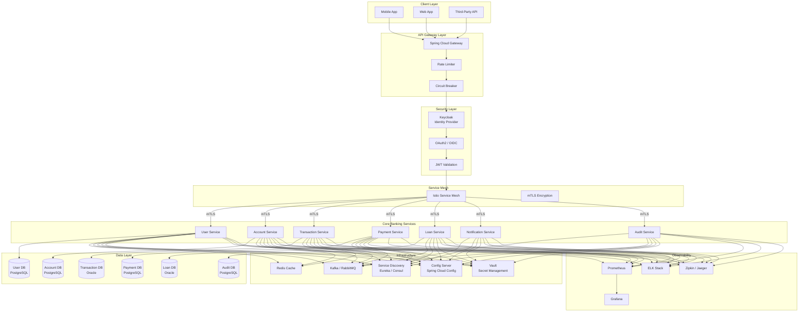

---

# 5. API Gateway Layer

The **Spring Cloud Gateway** acts as the single entry point for all client requests.

## 5.1 Responsibilities

- **Routing** — Forward requests to appropriate microservices
- **Rate Limiting** — Prevent abuse with token bucket algorithm
- **Authentication** — Validate JWT tokens before forwarding
- **Circuit Breaker** — Fail fast when downstream services are unavailable
- **Request/Response Transformation** — Normalize headers and payloads
- **CORS Management** — Handle cross-origin requests securely

## 5.2 Rate Limiting Strategy

```yaml
spring:
  cloud:
    gateway:
      routes:
        - id: account-service
          uri: lb://account-service
          predicates:
            - Path=/api/v1/accounts/**
          filters:
            - name: RequestRateLimiter
              args:
                redis-rate-limiter.replenishRate: 100
                redis-rate-limiter.burstCapacity: 200
```

## 5.3 Gateway Flow Diagram

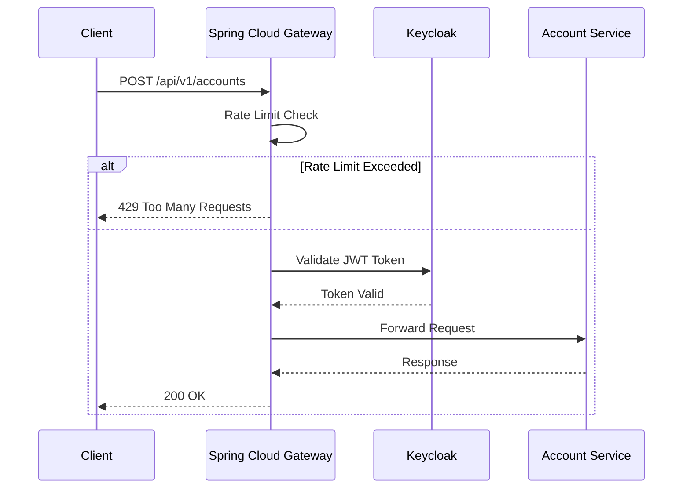

---

# 6. Identity & Access Management (IAM)

## 6.1 Keycloak Integration

**Keycloak** serves as the centralized identity provider with:

- **OAuth2 Authorization Server** — Issue access tokens
- **OpenID Connect** — Identity layer on top of OAuth2
- **Single Sign-On (SSO)** — Unified authentication across services
- **User Federation** — LDAP/Active Directory integration
- **Social Login** — Optional Google/Facebook login
- **Multi-Factor Authentication (MFA)** — TOTP/SMS verification

## 6.2 Authentication Flow

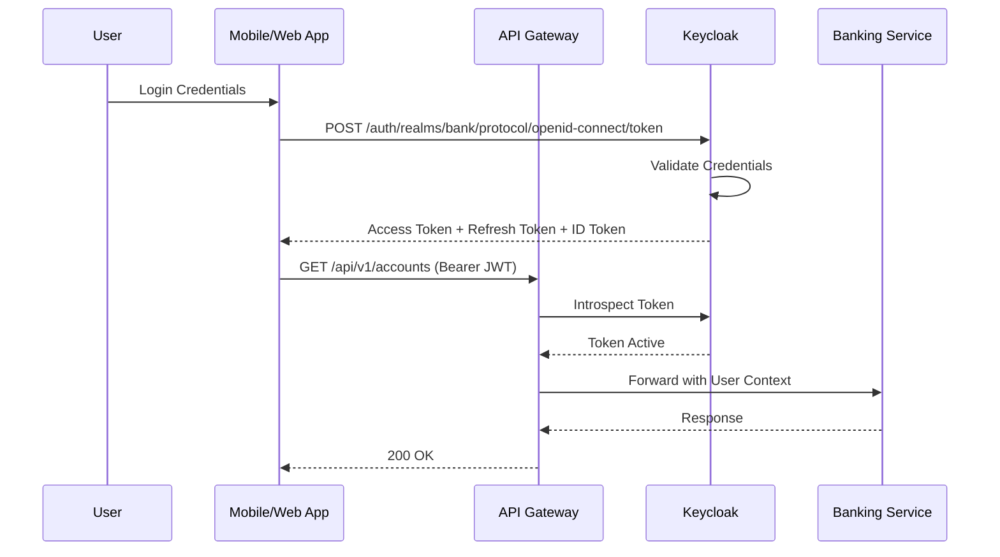

## 6.3 JWT Token Structure

```json
{
  "iss": "https://auth.bank.com/auth/realms/bank",
  "sub": "a1b2c3d4-e5f6-7890-abcd-ef1234567890",
  "aud": "account-service",
  "exp": 1715239200,
  "iat": 1715235600,
  "realm_access": {
    "roles": ["bank_admin", "account_viewer"]
  },
  "resource_access": {
    "account-service": {
      "roles": ["read", "write"]
    }
  }
}
```

---

# 7. Service Discovery & Configuration

## 7.1 Service Discovery with Eureka

Each microservice registers itself with **Eureka** on startup and periodically sends heartbeats.

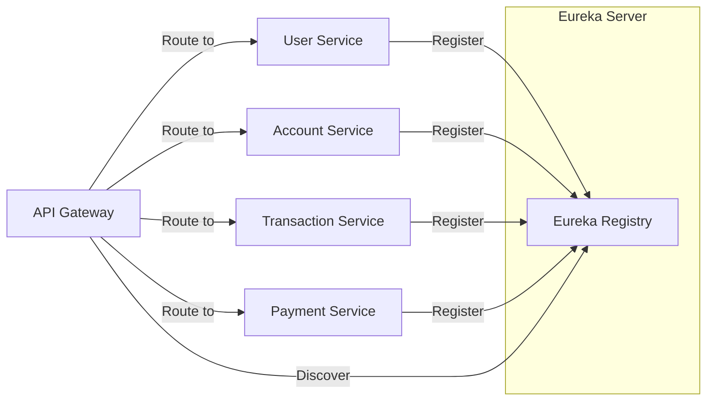

## 7.2 Centralized Configuration

**Spring Cloud Config Server** provides externalized configuration for all services.

```yaml
# application.yml in Config Server
spring:
  cloud:
    config:
      server:
        git:
          uri: https://git.bank.com/config-repo
          default-label: main
          search-paths: '{application}'
```

Each service fetches config at startup:

```yaml
# bootstrap.yml in each microservice
spring:
  application:
    name: account-service
  cloud:
    config:
      uri: http://config-server:8888
      fail-fast: true
      retry:
        initial-interval: 1000
        max-attempts: 5
```

---

# 8. Secret Management with HashiCorp Vault

## 8.1 Why Vault

- **Dynamic Secrets** — Generate database credentials on-demand
- **Encryption as a Service** — Encrypt sensitive data at rest
- **Audit Logging** — Track every secret access
- **Automatic Rotation** — Rotate credentials without downtime

## 8.2 Vault Integration

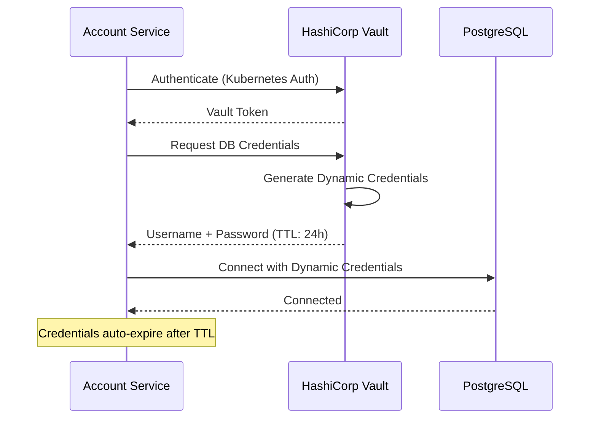

## 8.3 Spring Boot Vault Configuration

```yaml
spring:
  cloud:
    vault:
      host: vault.bank.com
      port: 8200
      scheme: https
      authentication: KUBERNETES
      kubernetes:
        role: account-service
        service-account-token-file: /var/run/secrets/kubernetes.io/serviceaccount/token
      database:
        enabled: true
        role: account-db-role
        backend: database
```

---

# 9. Distributed Caching with Redis

## 9.1 Caching Strategy

| Cache Type       | TTL    | Use Case                     |
| ---------------- | ------ | ---------------------------- |
| Session Cache    | 30 min | User sessions                |
| Account Cache    | 5 min  | Account balances             |
| Rate Limit Cache | 1 min  | API rate limiting            |
| Reference Data   | 1 hour | Currency codes, branch lists |

## 9.2 Redis Cache Architecture

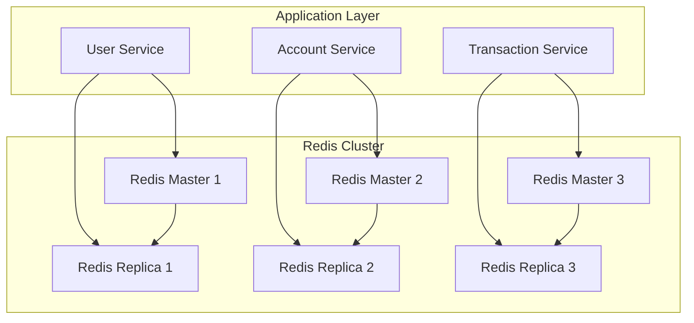

## 9.3 Spring Boot Redis Configuration

```java
@Configuration
@EnableCaching
public class RedisConfig {

    @Bean
    public RedisCacheManager cacheManager(RedisConnectionFactory factory) {
        RedisCacheConfiguration config = RedisCacheConfiguration.defaultCacheConfig()
            .entryTtl(Duration.ofMinutes(5))
            .serializeKeysWith(
                RedisSerializationContext.SerializationPair.fromSerializer(
                    new StringRedisSerializer()))
            .serializeValuesWith(
                RedisSerializationContext.SerializationPair.fromSerializer(
                    new GenericJackson2JsonRedisSerializer()));

        return RedisCacheManager.builder(factory)
            .cacheDefaults(config)
            .build();
    }
}
```

---

# 10. Banking Microservices

## 10.1 Service Breakdown

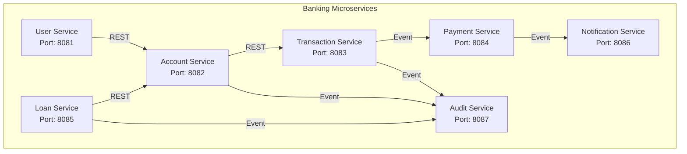

## 10.2 Service Details

### User Service

| Aspect         | Detail                                                                   |
| -------------- | ------------------------------------------------------------------------ |
| Responsibility | User registration, profile management, KYC verification                  |
| Endpoints      | `POST /api/v1/users`, `GET /api/v1/users/{id}`, `PUT /api/v1/users/{id}` |
| Database       | PostgreSQL — `users` schema                                              |
| Dependencies   | Redis (session cache), Kafka (user events)                               |

### Account Service

| Aspect         | Detail                                                                                    |
| -------------- | ----------------------------------------------------------------------------------------- |
| Responsibility | Account creation, balance inquiry, account closure                                        |
| Endpoints      | `POST /api/v1/accounts`, `GET /api/v1/accounts/{id}`, `GET /api/v1/accounts/{id}/balance` |
| Database       | PostgreSQL — `accounts` schema                                                            |
| Dependencies   | Redis (balance cache), User Service                                                       |

### Transaction Service

| Aspect         | Detail                                                                                           |
| -------------- | ------------------------------------------------------------------------------------------------ |
| Responsibility | Deposit, withdrawal, fund transfer, transaction history                                          |
| Endpoints      | `POST /api/v1/transactions`, `GET /api/v1/transactions/{id}`, `GET /api/v1/transactions/history` |
| Database       | Oracle — `transactions` schema                                                                   |
| Dependencies   | Account Service, Kafka (transaction events)                                                      |

### Payment Service

| Aspect         | Detail                                               |
| -------------- | ---------------------------------------------------- |
| Responsibility | Bill payment, merchant payment, QR payment           |
| Endpoints      | `POST /api/v1/payments`, `GET /api/v1/payments/{id}` |
| Database       | PostgreSQL — `payments` schema                       |
| Dependencies   | Transaction Service, Notification Service            |

### Loan Service

| Aspect         | Detail                                                                          |
| -------------- | ------------------------------------------------------------------------------- |
| Responsibility | Loan application, approval, repayment scheduling                                |
| Endpoints      | `POST /api/v1/loans`, `GET /api/v1/loans/{id}`, `POST /api/v1/loans/{id}/repay` |
| Database       | Oracle — `loans` schema                                                         |
| Dependencies   | Account Service, Credit Scoring Engine                                          |

### Notification Service

| Aspect         | Detail                                                  |
| -------------- | ------------------------------------------------------- |
| Responsibility | Email, SMS, push notification delivery                  |
| Endpoints      | `POST /api/v1/notifications/send`                       |
| Database       | PostgreSQL — `notifications` schema                     |
| Dependencies   | Kafka (consume events), Third-party SMS/Email providers |

### Audit Service

| Aspect         | Detail                                                        |
| -------------- | ------------------------------------------------------------- |
| Responsibility | Immutable audit log for compliance                            |
| Endpoints      | `GET /api/v1/audit/logs`, `GET /api/v1/audit/logs/{entityId}` |
| Database       | PostgreSQL — `audit` schema (append-only)                     |
| Dependencies   | Kafka (consume all domain events)                             |

---

# 11. Database Isolation Strategy

## 11.1 Database-Per-Service Pattern

Each microservice owns its database exclusively. No service directly accesses another service's database.

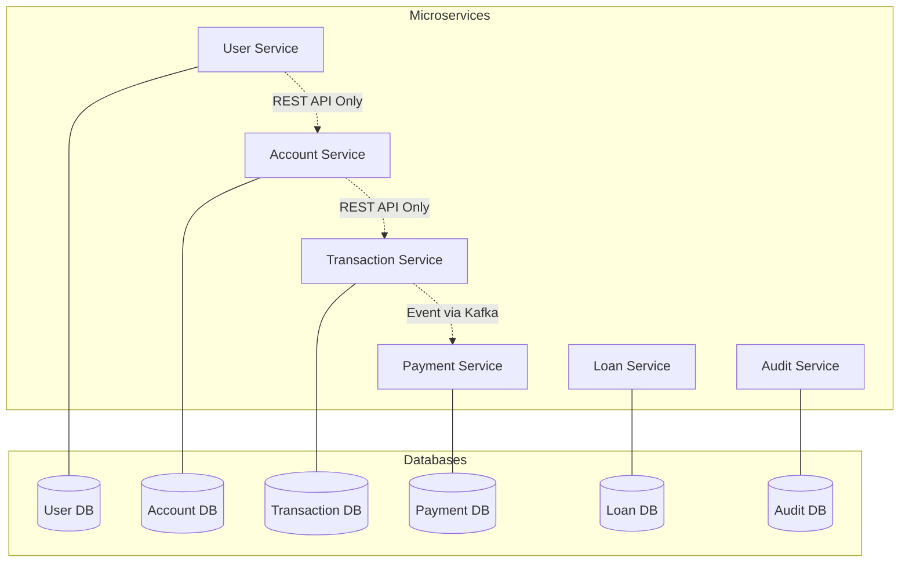

## 11.2 Data Consistency Strategy

| Pattern            | Implementation                                        |
| ------------------ | ----------------------------------------------------- |
| **Saga Pattern**   | Distributed transactions via Kafka choreography       |
| **Event Sourcing** | Audit service stores immutable event log              |
| **CQRS**           | Separate read/write models for high-volume services   |
| **Idempotency**    | Idempotency keys on all payment/transaction endpoints |

## 11.3 Saga Pattern for Fund Transfer

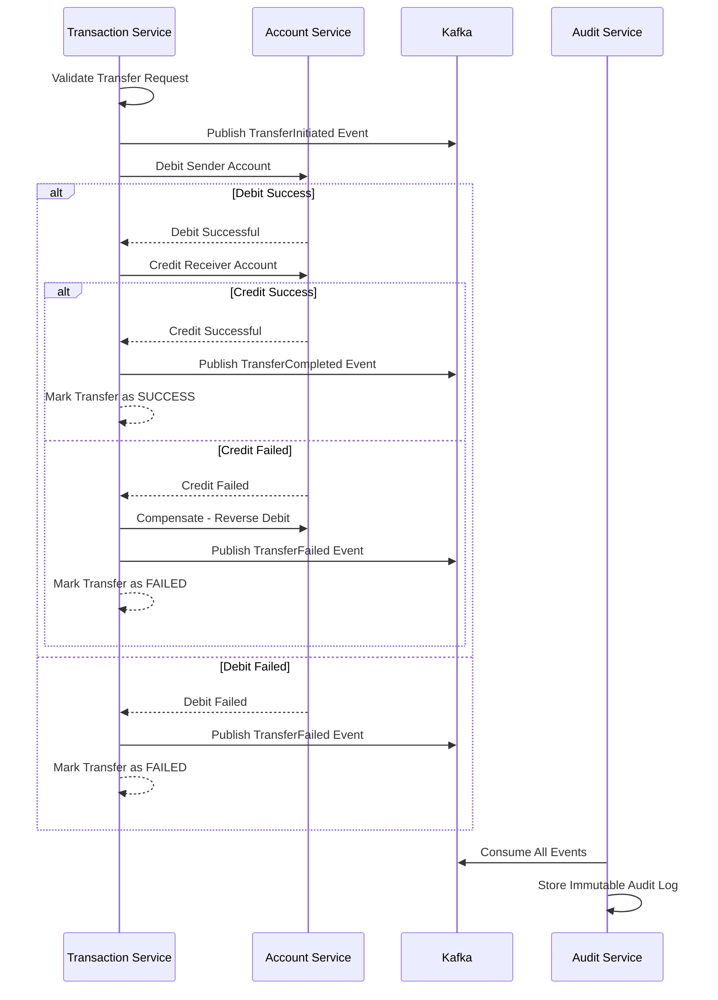

---

# 12. Event-Driven Communication

## 12.1 Kafka Event Architecture

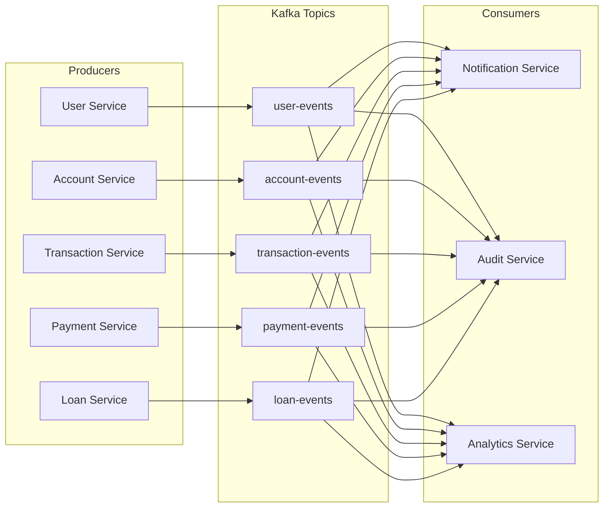

## 12.2 Event Schema Example

```json
{
  "event_id": "evt_a1b2c3d4-e5f6-7890-abcd-ef1234567890",
  "event_type": "TRANSACTION_COMPLETED",
  "source": "transaction-service",
  "timestamp": "2026-05-09T10:00:00Z",
  "trace_id": "trace_abc123",
  "data": {
    "transaction_id": "txn_987654",
    "from_account": "ACC-1001",
    "to_account": "ACC-2002",
    "amount": 500.0,
    "currency": "USD",
    "status": "COMPLETED"
  }
}
```

## 12.3 Spring Boot Kafka Producer

```java
@Service
public class EventPublisher {

    private final KafkaTemplate<String, DomainEvent> kafkaTemplate;

    public EventPublisher(KafkaTemplate<String, DomainEvent> kafkaTemplate) {
        this.kafkaTemplate = kafkaTemplate;
    }

    public void publish(DomainEvent event) {
        kafkaTemplate.send(event.getTopic(), event.getEventId(), event);
    }
}
```

## 12.4 Spring Boot Kafka Consumer

```java
@Component
public class NotificationConsumer {

    @KafkaListener(topics = {
        "user-events",
        "transaction-events",
        "payment-events"
    }, groupId = "notification-service")
    public void handleEvent(DomainEvent event) {
        switch (event.getEventType()) {
            case "TRANSACTION_COMPLETED" -> sendTransactionNotification(event);
            case "PAYMENT_RECEIVED" -> sendPaymentNotification(event);
            case "USER_REGISTERED" -> sendWelcomeEmail(event);
        }
    }
}
```

---

# 13. Observability Stack

## 13.1 Three Pillars of Observability

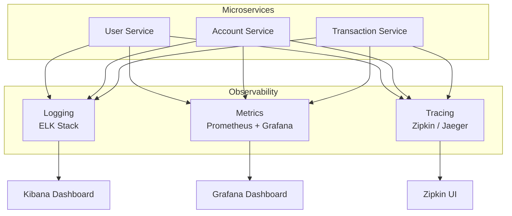

## 13.2 Distributed Tracing with Zipkin

```java
@Configuration
public class TracingConfig {

    @Bean
    public Tracer tracer() {
        return BraveTracer.create(
            Tracing.newBuilder()
                .localServiceName("account-service")
                .spanReporter(ZipkinReporter.create(
                    "http://zipkin:9411/api/v2/spans"))
                .build()
        );
    }
}
```

## 13.3 Metrics with Micrometer

```java
@RestController
public class AccountController {

    private final MeterRegistry meterRegistry;
    private final Counter accountCreatedCounter;

    public AccountController(MeterRegistry meterRegistry) {
        this.meterRegistry = meterRegistry;
        this.accountCreatedCounter = Counter.builder("accounts.created.total")
            .description("Total number of accounts created")
            .register(meterRegistry);
    }

    @PostMapping
    public ResponseEntity<Account> createAccount(@RequestBody AccountRequest request) {
        Account account = accountService.create(request);
        accountCreatedCounter.increment();
        return ResponseEntity.status(201).body(account);
    }
}
```

## 13.4 Logging Standard

```json
{
  "timestamp": "2026-05-09T10:00:00.123Z",
  "level": "INFO",
  "service": "account-service",
  "trace_id": "trace_abc123",
  "span_id": "span_def456",
  "user_id": "usr_7890",
  "message": "Account created successfully",
  "account_id": "ACC-1001",
  "duration_ms": 45
}
```

---

# 14. Zero Trust Security Model

## 14.1 Security Architecture

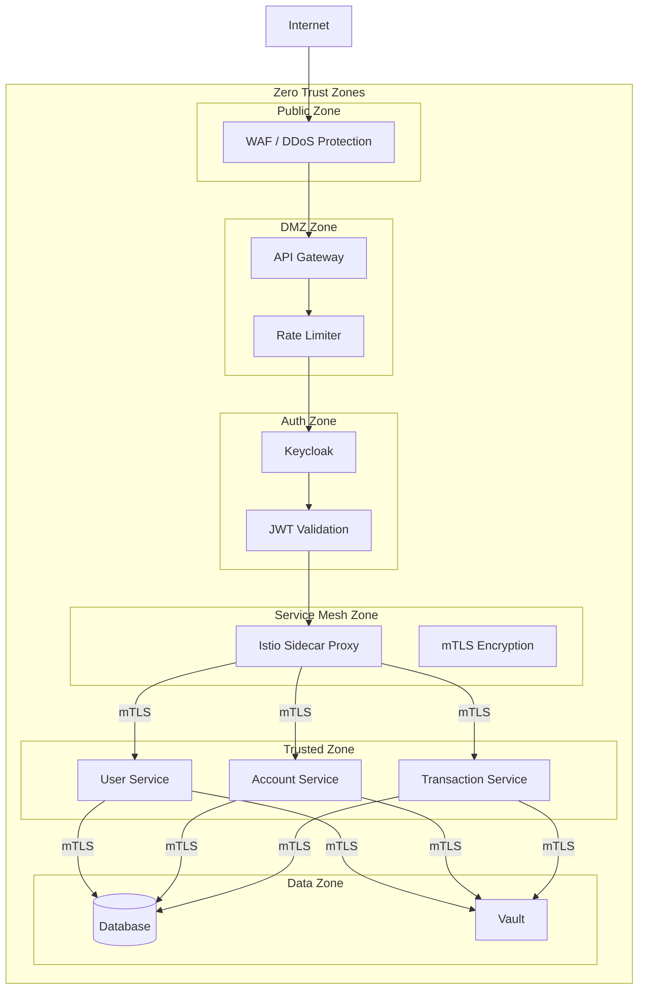

## 14.2 Security Controls

| Control                      | Implementation                                       |
| ---------------------------- | ---------------------------------------------------- |
| **Network Segmentation**     | Kubernetes namespaces with network policies          |
| **mTLS**                     | Istio mutual TLS between all services                |
| **JWT Validation**           | Every request validated at gateway and service level |
| **RBAC**                     | Role-based access control via Keycloak               |
| **Secret Rotation**          | Vault dynamic secrets with 24h TTL                   |
| **Audit Logging**            | Immutable audit trail for all sensitive operations   |
| **Rate Limiting**            | Per-client rate limits at API Gateway                |
| **SQL Injection Prevention** | Parameterized queries, ORM validation                |
| **Encryption at Rest**       | AES-256 for sensitive database columns               |
| **Encryption in Transit**    | TLS 1.3 for all communications                       |

## 14.3 Spring Boot Security Configuration

```java
@Configuration
@EnableWebSecurity
@EnableMethodSecurity
public class SecurityConfig {

    @Bean
    public SecurityFilterChain filterChain(HttpSecurity http) throws Exception {
        http
            .csrf(AbstractHttpConfigurer::disable)
            .sessionManagement(session ->
                session.sessionCreationPolicy(SessionCreationPolicy.STATELESS))
            .authorizeHttpRequests(auth -> auth
                .requestMatchers("/api/v1/admin/**").hasRole("BANK_ADMIN")
                .requestMatchers("/api/v1/accounts/**").hasAnyRole("BANK_USER", "BANK_ADMIN")
                .requestMatchers("/api/v1/transactions/**").authenticated()
                .anyRequest().authenticated()
            )
            .oauth2ResourceServer(oauth2 ->
                oauth2.jwt(Customizer.withDefaults()));

        return http.build();
    }
}
```

---

# 15. DevSecOps Pipeline

## 15.1 CI/CD Pipeline Flow

```mermaid
graph LR
    subgraph "CI Pipeline"
        A[Code Commit] --> B[Static Analysis\nSonarQube]
        B --> C[Security Scan\nTrivy]
        C --> D[Unit Tests]
        D --> E[Build Image\nDocker]
        E --> F[Push to Registry]
    end

    subgraph "CD Pipeline"
        F --> G[Deploy to Staging]
        G --> H[Integration Tests]
        H --> I[Security Tests\nOWASP ZAP]
        I --> J[Deploy to Production]
        J --> K[Health Check]
    end

    subgraph "Monitoring"
        K --> L[Prometheus Alerts]
        L --> M[Incident Response]
    end
```

## 15.2 Dockerfile Example

```dockerfile
FROM eclipse-temurin:21-jre-alpine AS builder
WORKDIR /app
COPY target/*.jar app.jar
RUN java -Djarmode=layertools -jar app.jar extract

FROM eclipse-temurin:21-jre-alpine
RUN addgroup -S appgroup && adduser -S appuser -G appgroup
WORKDIR /app
COPY --from=builder /app/dependencies/ ./
COPY --from=builder /app/spring-boot-loader/ ./
COPY --from=builder /app/snapshot-dependencies/ ./
COPY --from=builder /app/application/ ./
USER appuser
EXPOSE 8080
ENTRYPOINT ["java", "org.springframework.boot.loader.launch.JarLauncher"]
```

## 15.3 Kubernetes Deployment

```yaml
apiVersion: apps/v1
kind: Deployment
metadata:
  name: account-service
  namespace: banking
spec:
  replicas: 3
  selector:
    matchLabels:
      app: account-service
  template:
    metadata:
      labels:
        app: account-service
    spec:
      serviceAccountName: account-service-sa
      containers:
        - name: account-service
          image: bank.registry/account-service:latest
          ports:
            - containerPort: 8080
          env:
            - name: SPRING_PROFILES_ACTIVE
              value: 'k8s'
            - name: VAULT_ADDR
              value: 'https://vault.bank.com:8200'
          resources:
            requests:
              memory: '512Mi'
              cpu: '250m'
            limits:
              memory: '1Gi'
              cpu: '500m'
          livenessProbe:
            httpGet:
              path: /actuator/health/liveness
              port: 8080
            initialDelaySeconds: 30
            periodSeconds: 10
          readinessProbe:
            httpGet:
              path: /actuator/health/readiness
              port: 8080
            initialDelaySeconds: 20
            periodSeconds: 5
---
apiVersion: v1
kind: Service
metadata:
  name: account-service
  namespace: banking
spec:
  selector:
    app: account-service
  ports:
    - port: 8080
      targetPort: 8080
```

---

# 16. Deployment Architecture

## 16.1 Kubernetes Cluster Topology

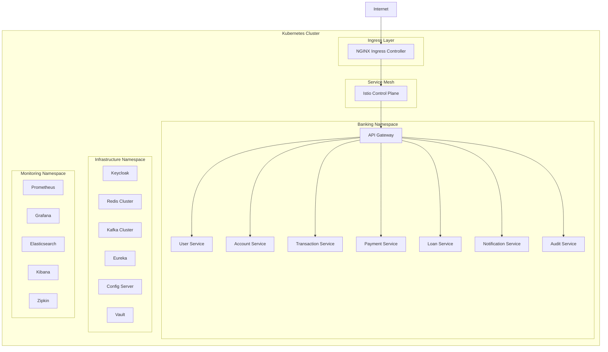

## 16.2 Auto-Scaling Strategy

```yaml
apiVersion: autoscaling/v2
kind: HorizontalPodAutoscaler
metadata:
  name: account-service-hpa
  namespace: banking
spec:
  scaleTargetRef:
    apiVersion: apps/v1
    kind: Deployment
    name: account-service
  minReplicas: 3
  maxReplicas: 10
  metrics:
    - type: Resource
      resource:
        name: cpu
        target:
          type: Utilization
          averageUtilization: 70
    - type: Resource
      resource:
        name: memory
        target:
          type: Utilization
          averageUtilization: 80
```

---

# 17. Conclusion

This enterprise banking microservices architecture provides:

| Requirement       | How It's Addressed                                                    |
| ----------------- | --------------------------------------------------------------------- |
| **Security**      | Zero Trust model, mTLS, OAuth2/OIDC, Vault secrets                    |
| **Scalability**   | Horizontal pod autoscaling, Redis caching, Kafka async processing     |
| **Availability**  | Circuit breakers, health probes, multi-replica deployments            |
| **Compliance**    | Immutable audit logs, database isolation, encryption at rest/transit  |
| **Observability** | Prometheus + Grafana, ELK Stack, distributed tracing                  |
| **Extensibility** | Independent services, event-driven communication, API Gateway routing |

The architecture follows **cloud-native best practices** and is designed to meet the rigorous demands of the banking industry while maintaining flexibility for future growth.
