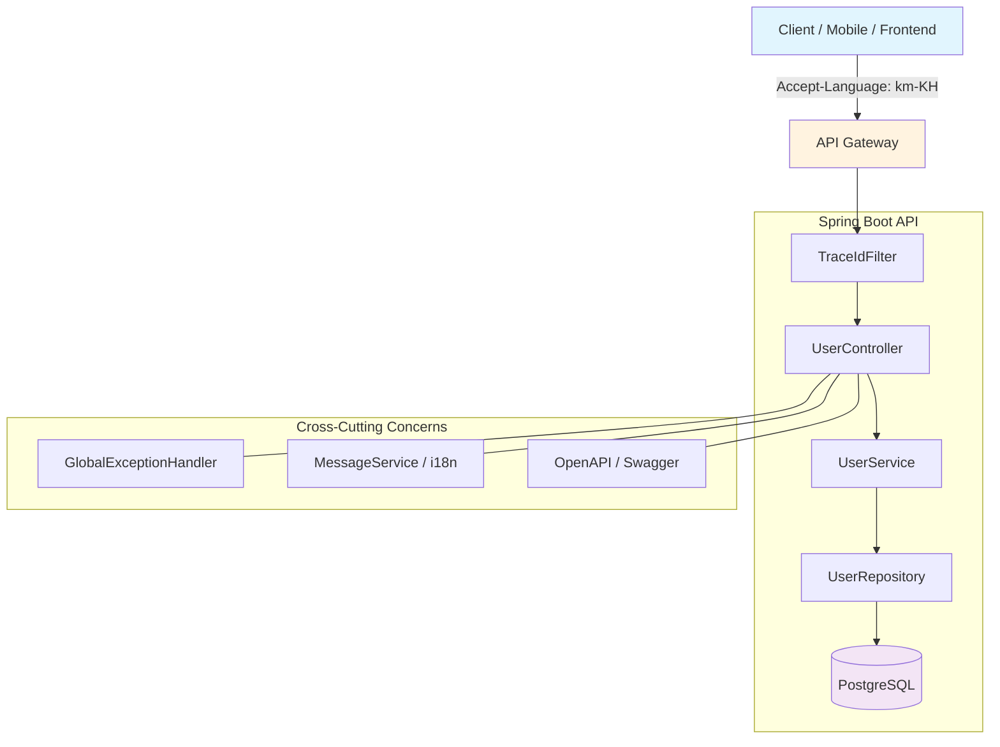

# Spring Boot API Design Template — Enterprise Implementation

This guide provides a **production-ready Spring Boot implementation** that follows the enterprise API design standards defined in [Core Principles of Enterprise API Design](/blog/architecture/1-api-design-concept). It covers:

- **JDK 21** features (Records, Pattern Matching, Virtual Threads)
- **Spring Boot 4** (Spring Framework 7) configuration
- Standardized API response wrapper with generics
- Multi-language (i18n) via `Accept-Language` header
- Cursor-based pagination for high-scale systems
- Global exception handling with proper HTTP status codes
- Enterprise error code system
- Validation architecture with structured errors
- Traceability with `trace_id` / correlation ID
- OpenAPI / Swagger documentation

## Table of Contents

- [1. Project Setup & Dependencies](#1-project-setup--dependencies)
  - [1.1 JDK 21 Features Used](#11-jdk-21-features-used)
  - [1.2 Maven Dependencies (Spring Boot 4)](#12-maven-dependencies-spring-boot-4)
  - [1.3 application.yml Configuration](#13-applicationyml-configuration)
- [2. Project Package Structure](#2-project-package-structure)
- [3. Standard API Response Wrapper](#3-standard-api-response-wrapper)
  - [3.1 ApiResponse — Generic Success Response](#31-apiresponse--generic-success-response)
  - [3.2 ApiError — Error Response](#32-apierror--error-response)
  - [3.3 ValidationErrorDetail — Field-Level Errors](#33-validationerrordetail--field-level-errors)
  - [3.4 ApiResponseBuilder — Fluent Builder](#34-apiresponsebuilder--fluent-builder)
- [4. Enterprise Error Code System](#4-enterprise-error-code-system)
  - [4.1 ErrorCode Enum](#41-errorcode-enum)
  - [4.2 BusinessException Hierarchy](#42-businessexception-hierarchy)
- [5. Multi-Language (i18n) Support](#5-multi-language-i18n-support)
  - [5.1 Message Properties Files](#51-message-properties-files)
  - [5.2 MessageSource Configuration](#52-messagesource-configuration)
  - [5.3 LocaleResolver — Accept-Language Header](#53-localeresolver--accept-language-header)
  - [5.4 MessageService — i18n Utility](#54-messageservice--i18n-utility)
- [6. Global Exception Handling](#6-global-exception-handling)
  - [6.1 GlobalExceptionHandler — @RestControllerAdvice](#61-globalexceptionhandler--restcontrolleradvice)
  - [6.2 Handling Validation Errors (HTTP 422)](#62-handling-validation-errors-http-422)
  - [6.3 Handling Business Exceptions (HTTP 409/404/400)](#63-handling-business-exceptions-http-409404400)
  - [6.4 Handling Unexpected Errors (HTTP 500)](#64-handling-unexpected-errors-http-500)
- [7. Cursor-Based Pagination](#7-cursor-based-pagination)
  - [7.1 CursorPage — Generic Pagination Response](#71-cursorpage--generic-pagination-response)
  - [7.2 CursorRequest — Request Parameters](#72-cursorrequest--request-parameters)
  - [7.3 CursorUtil — Encoding/Decoding Utility](#73-cursorutil--encodingdecoding-utility)
  - [7.4 Repository Implementation with JPA](#74-repository-implementation-with-jpa)
  - [7.5 Service Layer Example](#75-service-layer-example)
  - [7.6 Controller Example](#76-controller-example)
- [8. Validation Architecture](#8-validation-architecture)
  - [8.1 DTO with Jakarta Validation](#81-dto-with-jakarta-validation)
  - [8.2 Custom Validation Annotation](#82-custom-validation-annotation)
  - [8.3 Grouped Validation for Create/Update](#83-grouped-validation-for-createupdate)
- [9. Traceability — Trace ID / Correlation ID](#9-traceability--trace-id--correlation-id)
  - [9.1 TraceIdFilter — Generate & Propagate](#91-traceidfilter--generate--propagate)
  - [9.2 TraceIdContext — Holder Utility](#92-traceidcontext--holder-utility)
- [10. Complete Controller Example](#10-complete-controller-example)
  - [10.1 UserController — Full CRUD](#101-usercontroller--full-crud)
  - [10.2 UserService — Business Logic](#102-userservice--business-logic)
  - [10.3 UserRepository — Data Access](#103-userrepository--data-access)
- [11. OpenAPI / Swagger Configuration](#11-openapi--swagger-configuration)
- [12. Testing the API](#12-testing-the-api)
  - [12.1 cURL Examples](#121-curl-examples)
  - [12.2 Response Demonstrations](#122-response-demonstrations)
- [13. Conclusion](#13-conclusion)

## 1. Project Setup & Dependencies

### 1.1 JDK 21 Features Used

This template leverages modern JDK 21 features:

| Feature                   | Usage                                      |
| ------------------------- | ------------------------------------------ |
| **Records**               | DTOs, Response objects, Pagination request |
| **Sealed Classes**        | Exception hierarchy                        |
| **Pattern Matching**      | Exception handling with `instanceof`       |
| **Virtual Threads**       | Enabled in Spring Boot 4 via config        |
| **Text Blocks**           | Log messages, SQL queries                  |
| **Sequenced Collections** | Ordered data processing                    |

### 1.2 Maven Dependencies (Spring Boot 4)

```xml
<?xml version="1.0" encoding="UTF-8"?>
<project xmlns="http://maven.apache.org/POM/4.0.0"
         xmlns:xsi="http://www.w3.org/2001/XMLSchema-instance"
         xsi:schemaLocation="http://maven.apache.org/POM/4.0.0
         https://maven.apache.org/xsd/maven-4.0.0.xsd">
    <modelVersion>4.0.0</modelVersion>

    <parent>
        <groupId>org.springframework.boot</groupId>
        <artifactId>spring-boot-starter-parent</artifactId>
        <version>4.0.0</version>
        <relativePath/>
    </parent>

    <groupId>com.enterprise</groupId>
    <artifactId>api-template</artifactId>
    <version>1.0.0</version>
    <name>Enterprise API Template</name>

    <properties>
        <java.version>21</java.version>
    </properties>

    <dependencies>
        <!-- Spring Boot 4 Web -->
        <dependency>
            <groupId>org.springframework.boot</groupId>
            <artifactId>spring-boot-starter-web</artifactId>
        </dependency>

        <!-- Validation -->
        <dependency>
            <groupId>org.springframework.boot</groupId>
            <artifactId>spring-boot-starter-validation</artifactId>
        </dependency>

        <!-- JPA + Hibernate -->
        <dependency>
            <groupId>org.springframework.boot</groupId>
            <artifactId>spring-boot-starter-data-jpa</artifactId>
        </dependency>

        <!-- PostgreSQL Driver -->
        <dependency>
            <groupId>org.postgresql</groupId>
            <artifactId>postgresql</artifactId>
            <scope>runtime</scope>
        </dependency>

        <!-- OpenAPI / Swagger -->
        <dependency>
            <groupId>org.springdoc</groupId>
            <artifactId>springdoc-openapi-starter-webmvc-ui</artifactId>
            <version>2.8.0</version>
        </dependency>

        <!-- Lombok (optional, records preferred) -->
        <dependency>
            <groupId>org.projectlombok</groupId>
            <artifactId>lombok</artifactId>
            <optional>true</optional>
        </dependency>

        <!-- Testing -->
        <dependency>
            <groupId>org.springframework.boot</groupId>
            <artifactId>spring-boot-starter-test</artifactId>
            <scope>test</scope>
        </dependency>
    </dependencies>

    <build>
        <plugins>
            <plugin>
                <groupId>org.springframework.boot</groupId>
                <artifactId>spring-boot-maven-plugin</artifactId>
            </plugin>
        </plugins>
    </build>
</project>
```

### 1.3 application.yml Configuration

```yaml
server:
  port: 8080

spring:
  application:
    name: api-template

  # JPA Configuration
  jpa:
    hibernate:
      ddl-auto: validate
    show-sql: false
    properties:
      hibernate:
        format_sql: true
        jdbc:
          batch_size: 25

  # Datasource
  datasource:
    url: jdbc:postgresql://localhost:5432/enterprise_db
    username: ${DB_USERNAME:app_user}
    password: ${DB_PASSWORD:app_pass}
    hikari:
      maximum-pool-size: 20
      minimum-idle: 5
      idle-timeout: 300000
      connection-timeout: 20000

  # i18n Messages
  messages:
    basename: i18n/messages
    encoding: UTF-8
    fallback-to-system-locale: false

  # Virtual Threads (JDK 21)
  threads:
    virtual:
      enabled: true

# Logging
logging:
  level:
    com.enterprise: DEBUG
    org.springframework: INFO
  pattern:
    console: '%d{yyyy-MM-dd HH:mm:ss} [%thread] %-5level %logger{36} - %msg%n'

# OpenAPI
springdoc:
  api-docs:
    path: /api-docs
  swagger-ui:
    path: /swagger-ui.html
    operations-sorter: method
```

## 2. Project Package Structure

```
com.enterprise.api/
├── ApiTemplateApplication.java          # Main entry point
├── config/
│   ├── MessageConfig.java              # i18n configuration
│   ├── OpenApiConfig.java              # Swagger/OpenAPI config
│   └── WebConfig.java                  # Web MVC configuration
├── common/
│   ├── dto/
│   │   ├── ApiResponse.java            # Generic success response
│   │   ├── ApiError.java               # Error response
│   │   ├── ValidationErrorDetail.java  # Field-level error
│   │   └── CursorPage.java             # Cursor pagination response
│   ├── exception/
│   │   ├── ErrorCode.java              # Error code enum
│   │   ├── BusinessException.java      # Base business exception
│   │   ├── ResourceNotFoundException.java
│   │   ├── DuplicateResourceException.java
│   │   └── ValidationException.java
│   ├── pagination/
│   │   ├── CursorRequest.java          # Cursor request params
│   │   └── CursorUtil.java             # Cursor encode/decode
│   ├── filter/
│   │   └── TraceIdFilter.java          # Trace ID filter
│   └── context/
│       └── TraceIdContext.java         # Trace ID holder
├── user/
│   ├── dto/
│   │   ├── CreateUserRequest.java
│   │   ├── UpdateUserRequest.java
│   │   └── UserResponse.java
│   ├── model/
│   │   └── User.java                   # JPA entity
│   ├── repository/
│   │   └── UserRepository.java
│   ├── service/
│   │   └── UserService.java
│   └── controller/
│       └── UserController.java
└── advice/
    └── GlobalExceptionHandler.java     # Global exception handler
```

## 3. Standard API Response Wrapper

### 3.1 ApiResponse — Generic Success Response

This is the core wrapper for all successful API responses. It uses **Java Records** (JDK 16+) for immutability and conciseness.

```java
package com.enterprise.api.common.dto;

import com.fasterxml.jackson.annotation.JsonInclude;
import com.fasterxml.jackson.annotation.JsonPropertyOrder;
import io.swagger.v3.oas.annotations.media.Schema;

import java.time.Instant;

/**
 * Generic API response wrapper for all successful responses.
 * Follows enterprise standard: success, code, message, data, meta, timestamp, trace_id.
 *
 * @param <T> the type of the data payload
 */
@Schema(description = "Standard API success response")
@JsonPropertyOrder({"success", "code", "message", "data", "meta", "timestamp", "trace_id"})
public record ApiResponse<T>(
        @Schema(description = "Indicates success", example = "true")
        boolean success,

        @Schema(description = "Business code", example = "SUCCESS")
        String code,

        @Schema(description = "Human-readable message", example = "User fetched successfully")
        String message,

        @JsonInclude(JsonInclude.Include.NON_NULL)
        @Schema(description = "Response payload")
        T data,

        @JsonInclude(JsonInclude.Include.NON_NULL)
        @Schema(description = "Pagination or additional metadata")
        Object meta,

        @Schema(description = "Server response timestamp", example = "2026-05-09T10:00:00Z")
        Instant timestamp,

        @Schema(description = "Trace ID for debugging", example = "f8b7b1d2-88f9-4cb4-b55e-a3c76c1d0a88")
        String traceId
) {

    /**
     * Create a success response with data.
     */
    public static <T> ApiResponse<T> success(T data, String message) {
        return new ApiResponse<>(
                true,
                "SUCCESS",
                message,
                data,
                null,
                Instant.now(),
                TraceIdContext.getTraceId()
        );
    }

    /**
     * Create a success response with data and pagination meta.
     */
    public static <T> ApiResponse<T> success(T data, Object meta, String message) {
        return new ApiResponse<>(
                true,
                "SUCCESS",
                message,
                data,
                meta,
                Instant.now(),
                TraceIdContext.getTraceId()
        );
    }

    /**
     * Create a success response with no data (e.g., delete).
     */
    public static <T> ApiResponse<T> success(String message) {
        return new ApiResponse<>(
                true,
                "SUCCESS",
                message,
                null,
                null,
                Instant.now(),
                TraceIdContext.getTraceId()
        );
    }
}
```

### 3.2 ApiError — Error Response

```java
package com.enterprise.api.common.dto;

import com.fasterxml.jackson.annotation.JsonInclude;
import com.fasterxml.jackson.annotation.JsonPropertyOrder;
import io.swagger.v3.oas.annotations.media.Schema;

import java.time.Instant;
import java.util.Map;

/**
 * Standard error response for all API errors.
 * Follows enterprise standard with structured validation errors.
 */
@Schema(description = "Standard API error response")
@JsonPropertyOrder({"success", "code", "message", "errors", "timestamp", "trace_id"})
public record ApiError(
        @Schema(description = "Indicates failure", example = "false")
        boolean success,

        @Schema(description = "Error code", example = "VALIDATION_ERROR")
        String code,

        @Schema(description = "Human-readable error message", example = "Validation failed")
        String message,

        @JsonInclude(JsonInclude.Include.NON_NULL)
        @Schema(description = "Field-level validation errors")
        Map<String, java.util.List<ValidationErrorDetail>> errors,

        @Schema(description = "Server response timestamp", example = "2026-05-09T10:00:00Z")
        Instant timestamp,

        @Schema(description = "Trace ID for debugging", example = "4e2fbc91-1a82-4c7e-b5f0-cf15cb53d912")
        String traceId
) {

    /**
     * Create a simple error response without field errors.
     */
    public static ApiError of(String code, String message) {
        return new ApiError(
                false,
                code,
                message,
                null,
                Instant.now(),
                TraceIdContext.getTraceId()
        );
    }

    /**
     * Create a validation error response with field-level errors.
     */
    public static ApiError validationError(
            String message,
            Map<String, java.util.List<ValidationErrorDetail>> errors
    ) {
        return new ApiError(
                false,
                "VALIDATION_ERROR",
                message,
                errors,
                Instant.now(),
                TraceIdContext.getTraceId()
        );
    }
}
```

### 3.3 ValidationErrorDetail — Field-Level Errors

```java
package com.enterprise.api.common.dto;

import io.swagger.v3.oas.annotations.media.Schema;

/**
 * Represents a single validation error for a specific field.
 * Contains a machine-readable code and human-readable message.
 */
@Schema(description = "Field-level validation error detail")
public record ValidationErrorDetail(
        @Schema(description = "Error code for programmatic handling", example = "REQUIRED")
        String code,

        @Schema(description = "Human-readable error message", example = "Email is required")
        String message
) {}
```

### 3.4 ApiResponseBuilder — Fluent Builder (Alternative)

For complex responses, a builder pattern can be used:

```java
package com.enterprise.api.common.dto;

import java.time.Instant;
import java.util.function.Consumer;

/**
 * Fluent builder for ApiResponse when you need more control.
 */
public class ApiResponseBuilder<T> {
    private boolean success;
    private String code;
    private String message;
    private T data;
    private Object meta;
    private Instant timestamp;
    private String traceId;

    public ApiResponseBuilder<T> success(boolean success) {
        this.success = success;
        return this;
    }

    public ApiResponseBuilder<T> code(String code) {
        this.code = code;
        return this;
    }

    public ApiResponseBuilder<T> message(String message) {
        this.message = message;
        return this;
    }

    public ApiResponseBuilder<T> data(T data) {
        this.data = data;
        return this;
    }

    public ApiResponseBuilder<T> meta(Object meta) {
        this.meta = meta;
        return this;
    }

    public ApiResponseBuilder<T> traceId(String traceId) {
        this.traceId = traceId;
        return this;
    }

    public ApiResponse<T> build() {
        return new ApiResponse<>(
                success,
                code,
                message,
                data,
                meta,
                timestamp != null ? timestamp : Instant.now(),
                traceId != null ? traceId : TraceIdContext.getTraceId()
        );
    }

    public static <T> ApiResponseBuilder<T> builder() {
        return new ApiResponseBuilder<>();
    }
}
```

## 4. Enterprise Error Code System

### 4.1 ErrorCode Enum

Stable, machine-readable error codes that **never change** — even if the message text changes.

```java
package com.enterprise.api.common.exception;

/**
 * Enterprise error codes.
 * These codes are stable and should NEVER be changed or removed.
 * New codes can be added as needed.
 */
public enum ErrorCode {

    // ─── General ───────────────────────────────────────────────
    SUCCESS("SUCCESS"),
    INTERNAL_ERROR("INTERNAL_ERROR"),
    VALIDATION_ERROR("VALIDATION_ERROR"),
    RESOURCE_NOT_FOUND("RESOURCE_NOT_FOUND"),
    UNAUTHORIZED("UNAUTHORIZED"),
    FORBIDDEN("FORBIDDEN"),
    METHOD_NOT_ALLOWED("METHOD_NOT_ALLOWED"),
    RATE_LIMIT_EXCEEDED("RATE_LIMIT_EXCEEDED"),

    // ─── Authentication ────────────────────────────────────────
    INVALID_CREDENTIALS("INVALID_CREDENTIALS"),
    TOKEN_EXPIRED("TOKEN_EXPIRED"),
    TOKEN_INVALID("TOKEN_INVALID"),
    ACCOUNT_LOCKED("ACCOUNT_LOCKED"),

    // ─── Business Errors ───────────────────────────────────────
    EMAIL_ALREADY_EXISTS("EMAIL_ALREADY_EXISTS"),
    INSUFFICIENT_BALANCE("INSUFFICIENT_BALANCE"),
    ORDER_ALREADY_CANCELLED("ORDER_ALREADY_CANCELLED"),
    DUPLICATE_RESOURCE("DUPLICATE_RESOURCE"),
    INVALID_STATE_TRANSITION("INVALID_STATE_TRANSITION"),

    // ─── Validation ────────────────────────────────────────────
    REQUIRED("REQUIRED"),
    INVALID_FORMAT("INVALID_FORMAT"),
    MIN_LENGTH("MIN_LENGTH"),
    MAX_LENGTH("MAX_LENGTH"),
    INVALID_EMAIL_FORMAT("INVALID_EMAIL_FORMAT"),
    OUT_OF_RANGE("OUT_OF_RANGE");

    private final String code;

    ErrorCode(String code) {
        this.code = code;
    }

    public String getCode() {
        return code;
    }

    @Override
    public String toString() {
        return code;
    }
}
```

### 4.2 BusinessException Hierarchy

Using **sealed classes** (JDK 21) to create a controlled exception hierarchy:

```java
package com.enterprise.api.common.exception;

/**
 * Base sealed exception for all business exceptions.
 * Only permitted subclasses can extend this.
 */
public sealed class BusinessException extends RuntimeException
        permits ResourceNotFoundException,
                DuplicateResourceException,
                ValidationException,
                InsufficientBalanceException,
                InvalidStateTransitionException {

    private final ErrorCode errorCode;
    private final transient Object[] args;

    public BusinessException(ErrorCode errorCode, String message, Object... args) {
        super(message);
        this.errorCode = errorCode;
        this.args = args;
    }

    public BusinessException(ErrorCode errorCode, String message, Throwable cause, Object... args) {
        super(message, cause);
        this.errorCode = errorCode;
        this.args = args;
    }

    public ErrorCode getErrorCode() {
        return errorCode;
    }

    public Object[] getArgs() {
        return args;
    }
}
```

**Permitted subclasses:**

```java
package com.enterprise.api.common.exception;

public final class ResourceNotFoundException extends BusinessException {
    public ResourceNotFoundException(String resourceType, Object identifier) {
        super(ErrorCode.RESOURCE_NOT_FOUND,
              "%s not found with identifier: %s".formatted(resourceType, identifier));
    }
}
```

```java
package com.enterprise.api.common.exception;

public final class DuplicateResourceException extends BusinessException {
    public DuplicateResourceException(String resourceType, String field, Object value) {
        super(ErrorCode.DUPLICATE_RESOURCE,
              "%s already exists with %s: %s".formatted(resourceType, field, value));
    }
}
```

```java
package com.enterprise.api.common.exception;

public final class ValidationException extends BusinessException {
    public ValidationException(String message) {
        super(ErrorCode.VALIDATION_ERROR, message);
    }
}
```

```java
package com.enterprise.api.common.exception;

public final class InsufficientBalanceException extends BusinessException {
    public InsufficientBalanceException() {
        super(ErrorCode.INSUFFICIENT_BALANCE, "Account balance is insufficient");
    }
}
```

```java
package com.enterprise.api.common.exception;

public final class InvalidStateTransitionException extends BusinessException {
    public InvalidStateTransitionException(String currentState, String targetState) {
        super(ErrorCode.INVALID_STATE_TRANSITION,
              "Cannot transition from %s to %s".formatted(currentState, targetState));
    }
}
```

## 5. Multi-Language (i18n) Support

### 5.1 Message Properties Files

**`src/main/resources/i18n/messages.properties`** (default — English)

```properties
# ─── Success Messages ──────────────────────────────────
success.operation=Operation successful
success.fetched={0} fetched successfully
success.created={0} created successfully
success.updated={0} updated successfully
success.deleted={0} deleted successfully

# ─── Error Messages ────────────────────────────────────
error.internal=Unexpected server error
error.validation=Validation failed
error.not.found={0} not found with {1}: {2}
error.duplicate={0} already exists with {1}: {2}
error.unauthorized=Authentication required
error.forbidden=Access denied
error.insufficient.balance=Account balance is insufficient
error.invalid.state=Cannot transition from {0} to {1}

# ─── Validation Messages ───────────────────────────────
validation.required={0} is required
validation.email=Email format is invalid
validation.min.length={0} must be at least {1} characters
validation.max.length={0} must not exceed {1} characters
validation.range={0} must be between {1} and {2}
```

**`src/main/resources/i18n/messages_km.properties`** (Khmer)

```properties
# ─── Success Messages ──────────────────────────────────
success.operation=ប្រតិបត្តិការបានជោគជ័យ
success.fetched={0} ត្រូវបានទាញយកដោយជោគជ័យ
success.created={0} ត្រូវបានបង្កើតដោយជោគជ័យ
success.updated={0} ត្រូវបានធ្វើបច្ចុប្បន្នភាពដោយជោគជ័យ
success.deleted={0} ត្រូវបានលុបដោយជោគជ័យ

# ─── Error Messages ────────────────────────────────────
error.internal=កំហុសម៉ាស៊ីនមេដែលមិនបានរំពឹងទុក
error.validation=សុពលភាពបរាជ័យ
error.not.found={0} រកមិនឃើញជាមួយ {1}: {2}
error.duplicate={0} មានរួចហើយជាមួយ {1}: {2}
error.unauthorized=តម្រូវឱ្យមានការផ្ទៀងផ្ទាត់
error.forbidden=ការចូលប្រើត្រូវបានបដិសេធ
error.insufficient.balance=សមតុល្យគណនីមិនគ្រប់គ្រាន់
error.invalid.state=មិនអាចផ្លាស់ប្តូរពី {0} ទៅ {1}

# ─── Validation Messages ───────────────────────────────
validation.required={0} ត្រូវបានទាមទារ
validation.email=ទម្រង់អ៊ីមែលមិនត្រឹមត្រូវ
validation.min.length={0} ត្រូវតែយ៉ាងហោចណាស់ {1} តួអក្សរ
validation.max.length={0} មិនត្រូវលើសពី {1} តួអក្សរ
validation.range={0} ត្រូវតែស្ថិតនៅចន្លោះ {1} និង {2}
```

### 5.2 MessageSource Configuration

```java
package com.enterprise.api.config;

import org.springframework.context.MessageSource;
import org.springframework.context.annotation.Bean;
import org.springframework.context.annotation.Configuration;
import org.springframework.context.support.ReloadableResourceBundleMessageSource;
import org.springframework.validation.beanvalidation.LocalValidatorFactoryBean;

import java.nio.charset.StandardCharsets;

@Configuration
public class MessageConfig {

    @Bean
    public MessageSource messageSource() {
        var messageSource = new ReloadableResourceBundleMessageSource();
        messageSource.setBasename("classpath:i18n/messages");
        messageSource.setDefaultEncoding(StandardCharsets.UTF_8.name());
        messageSource.setFallbackToSystemLocale(false);
        messageSource.setDefaultLocale(java.util.Locale.ENGLISH);
        // Cache for 1 hour, reload on change in development
        messageSource.setCacheMillis(3600);
        return messageSource;
    }

    /**
     * Integrate MessageSource with Jakarta Validator so
     * validation messages also support i18n.
     */
    @Bean
    public LocalValidatorFactoryBean validator(MessageSource messageSource) {
        var bean = new LocalValidatorFactoryBean();
        bean.setValidationMessageSource(messageSource);
        return bean;
    }
}
```

### 5.3 LocaleResolver — Accept-Language Header

```java
package com.enterprise.api.config;

import jakarta.servlet.http.HttpServletRequest;
import jakarta.servlet.http.HttpServletResponse;
import org.springframework.context.annotation.Bean;
import org.springframework.context.annotation.Configuration;
import org.springframework.web.servlet.LocaleResolver;
import org.springframework.web.servlet.i18n.AcceptHeaderLocaleResolver;

import java.util.Arrays;
import java.util.List;
import java.util.Locale;

@Configuration
public class WebConfig implements org.springframework.web.servlet.config.annotation.WebMvcConfigurer {

    /**
     * Supported locales for i18n.
     */
    private static final List<Locale> SUPPORTED_LOCALES = Arrays.asList(
            Locale.ENGLISH,           // en
            Locale.of("km", "KH"),    // km-KH (Khmer)
            Locale.of("ko", "KR"),    // ko-KR (Korean)
            Locale.of("zh", "CN")     // zh-CN (Chinese)
    );

    @Bean
    public LocaleResolver localeResolver() {
        var resolver = new AcceptHeaderLocaleResolver() {
            @Override
            public Locale resolveLocale(HttpServletRequest request) {
                String acceptLanguage = request.getHeader("Accept-Language");
                if (acceptLanguage == null || acceptLanguage.isBlank()) {
                    return Locale.ENGLISH;
                }
                var locales = Locale.LanguageRange.parse(acceptLanguage);
                if (locales.isEmpty()) {
                    return Locale.ENGLISH;
                }
                var resolved = Locale.lookup(locales, SUPPORTED_LOCALES);
                return resolved != null ? resolved : Locale.ENGLISH;
            }
        };
        resolver.setDefaultLocale(Locale.ENGLISH);
        return resolver;
    }
}
```

### 5.4 MessageService — i18n Utility

```java
package com.enterprise.api.common.service;

import org.springframework.context.MessageSource;
import org.springframework.context.i18n.LocaleContextHolder;
import org.springframework.stereotype.Service;

import java.util.Locale;

/**
 * Service for resolving i18n messages.
 * Automatically uses the locale from Accept-Language header.
 */
@Service
public class MessageService {

    private final MessageSource messageSource;

    public MessageService(MessageSource messageSource) {
        this.messageSource = messageSource;
    }

    /**
     * Get a localized message by key.
     */
    public String get(String key, Object... args) {
        Locale locale = LocaleContextHolder.getLocale();
        return messageSource.getMessage(key, args, key, locale);
    }

    /**
     * Get a localized message with a fallback if key not found.
     */
    public String getOrDefault(String key, String defaultMessage, Object... args) {
        try {
            return get(key, args);
        } catch (Exception e) {
            return defaultMessage;
        }
    }

    /**
     * Get a localized validation error message.
     */
    public String getValidationMessage(String field, String errorCode, Object... args) {
        String key = "validation." + errorCode.toLowerCase();
        Object[] allArgs = new Object[args.length + 1];
        allArgs[0] = field;
        System.arraycopy(args, 0, allArgs, 1, args.length);
        return getOrDefault(key, errorCode, allArgs);
    }
}
```

## 6. Global Exception Handling

### 6.1 GlobalExceptionHandler — @RestControllerAdvice

This is the **centralized exception handler** that ensures every error response follows the enterprise standard format.

```java
package com.enterprise.api.advice;

import com.enterprise.api.common.dto.ApiError;
import com.enterprise.api.common.dto.ValidationErrorDetail;
import com.enterprise.api.common.exception.*;
import com.enterprise.api.common.service.MessageService;
import jakarta.validation.ConstraintViolationException;
import org.slf4j.Logger;
import org.slf4j.LoggerFactory;
import org.springframework.http.HttpStatus;
import org.springframework.http.ResponseEntity;
import org.springframework.http.converter.HttpMessageNotReadableException;
import org.springframework.validation.FieldError;
import org.springframework.web.bind.MethodArgumentNotValidException;
import org.springframework.web.bind.MissingServletRequestParameterException;
import org.springframework.web.bind.annotation.ExceptionHandler;
import org.springframework.web.bind.annotation.RestControllerAdvice;
import org.springframework.web.method.annotation.MethodArgumentTypeMismatchException;

import java.util.*;
import java.util.stream.Collectors;

/**
 * Global exception handler that converts all exceptions
 * into the standard ApiError format with proper HTTP status codes.
 */
@RestControllerAdvice
public class GlobalExceptionHandler {

    private static final Logger log = LoggerFactory.getLogger(GlobalExceptionHandler.class);
    private final MessageService messageService;

    public GlobalExceptionHandler(MessageService messageService) {
        this.messageService = messageService;
    }

    // ─── 1. Validation Errors → HTTP 422 ───────────────────────

    /**
     * Handles @Valid annotation validation failures.
     * Returns HTTP 422 with structured field-level errors.
     */
    @ExceptionHandler(MethodArgumentNotValidException.class)
    public ResponseEntity<ApiError> handleValidationErrors(MethodArgumentNotValidException ex) {
        Map<String, List<ValidationErrorDetail>> errors = ex.getBindingResult()
                .getFieldErrors()
                .stream()
                .collect(Collectors.groupingBy(
                        FieldError::getField,
                        LinkedHashMap::new,
                        Collectors.mapping(this::toValidationErrorDetail, Collectors.toList())
                ));

        String message = messageService.get("error.validation");
        ApiError response = ApiError.validationError(message, errors);
        return ResponseEntity.status(HttpStatus.UNPROCESSABLE_ENTITY).body(response);
    }

    /**
     * Handles constraint violations on path variables, query params, etc.
     */
    @ExceptionHandler(ConstraintViolationException.class)
    public ResponseEntity<ApiError> handleConstraintViolation(ConstraintViolationException ex) {
        Map<String, List<ValidationErrorDetail>> errors = new LinkedHashMap<>();
        ex.getConstraintViolations().forEach(violation -> {
            String field = violation.getPropertyPath().toString();
            String code = violation.getConstraintDescriptor().getAnnotation().annotationType().getSimpleName();
            String msg = violation.getMessage();
            errors.computeIfAbsent(field, k -> new ArrayList<>())
                    .add(new ValidationErrorDetail(code.toUpperCase(), msg));
        });

        String message = messageService.get("error.validation");
        ApiError response = ApiError.validationError(message, errors);
        return ResponseEntity.status(HttpStatus.UNPROCESSABLE_ENTITY).body(response);
    }

    /**
     * Handles missing request parameters (e.g., required query params).
     */
    @ExceptionHandler(MissingServletRequestParameterException.class)
    public ResponseEntity<ApiError> handleMissingParam(MissingServletRequestParameterException ex) {
        String message = messageService.get("error.validation");
        var error = new ValidationErrorDetail("REQUIRED", ex.getParameterName() + " is required");
        var errors = Map.of(ex.getParameterName(), List.of(error));
        ApiError response = ApiError.validationError(message, errors);
        return ResponseEntity.status(HttpStatus.UNPROCESSABLE_ENTITY).body(response);
    }

    // ─── 2. Business Exceptions → HTTP 409 / 404 / 400 ────────

    /**
     * Handles ResourceNotFoundException → HTTP 404.
     */
    @ExceptionHandler(ResourceNotFoundException.class)
    public ResponseEntity<ApiError> handleNotFound(ResourceNotFoundException ex) {
        log.warn("Resource not found: {}", ex.getMessage());
        String message = messageService.get("error.not.found", ex.getArgs());
        ApiError response = ApiError.of(ex.getErrorCode().getCode(), message);
        return ResponseEntity.status(HttpStatus.NOT_FOUND).body(response);
    }

    /**
     * Handles DuplicateResourceException → HTTP 409.
     */
    @ExceptionHandler(DuplicateResourceException.class)
    public ResponseEntity<ApiError> handleDuplicate(DuplicateResourceException ex) {
        log.warn("Duplicate resource: {}", ex.getMessage());
        String message = messageService.get("error.duplicate", ex.getArgs());
        ApiError response = ApiError.of(ex.getErrorCode().getCode(), message);
        return ResponseEntity.status(HttpStatus.CONFLICT).body(response);
    }

    /**
     * Handles InsufficientBalanceException → HTTP 409.
     */
    @ExceptionHandler(InsufficientBalanceException.class)
    public ResponseEntity<ApiError> handleInsufficientBalance(InsufficientBalanceException ex) {
        log.warn("Insufficient balance: {}", ex.getMessage());
        String message = messageService.get("error.insufficient.balance");
        ApiError response = ApiError.of(ex.getErrorCode().getCode(), message);
        return ResponseEntity.status(HttpStatus.CONFLICT).body(response);
    }

    /**
     * Handles InvalidStateTransitionException → HTTP 409.
     */
    @ExceptionHandler(InvalidStateTransitionException.class)
    public ResponseEntity<ApiError> handleInvalidState(InvalidStateTransitionException ex) {
        log.warn("Invalid state transition: {}", ex.getMessage());
        String message = messageService.get("error.invalid.state", ex.getArgs());
        ApiError response = ApiError.of(ex.getErrorCode().getCode(), message);
        return ResponseEntity.status(HttpStatus.CONFLICT).body(response);
    }

    /**
     * Handles generic BusinessException → HTTP 400.
     */
    @ExceptionHandler(BusinessException.class)
    public ResponseEntity<ApiError> handleBusinessException(BusinessException ex) {
        log.warn("Business exception: {} - {}", ex.getErrorCode(), ex.getMessage());
        ApiError response = ApiError.of(ex.getErrorCode().getCode(), ex.getMessage());
        return ResponseEntity.status(HttpStatus.BAD_REQUEST).body(response);
    }

    // ─── 3. Authentication / Authorization → HTTP 401 / 403 ────

    /**
     * Handles authentication errors → HTTP 401.
     */
    @ExceptionHandler(org.springframework.security.access.AccessDeniedException.class)
    public ResponseEntity<ApiError> handleAccessDenied() {
        String message = messageService.get("error.forbidden");
        ApiError response = ApiError.of(ErrorCode.FORBIDDEN.getCode(), message);
        return ResponseEntity.status(HttpStatus.FORBIDDEN).body(response);
    }

    // ─── 4. Unexpected Errors → HTTP 500 ───────────────────────

    /**
     * Handles all unhandled exceptions → HTTP 500.
     * NEVER leaks internal details to the client.
     */
    @ExceptionHandler(Exception.class)
    public ResponseEntity<ApiError> handleUnexpected(Exception ex) {
        log.error("Unexpected error occurred", ex);
        String message = messageService.get("error.internal");
        ApiError response = ApiError.of(ErrorCode.INTERNAL_ERROR.getCode(), message);
        return ResponseEntity.status(HttpStatus.INTERNAL_SERVER_ERROR).body(response);
    }

    // ─── 5. HTTP Message Parsing Errors → HTTP 400 ─────────────

    /**
     * Handles malformed JSON requests.
     */
    @ExceptionHandler(HttpMessageNotReadableException.class)
    public ResponseEntity<ApiError> handleMalformedJson(HttpMessageNotReadableException ex) {
        log.warn("Malformed request body: {}", ex.getMessage());
        String message = messageService.get("error.validation");
        ApiError response = ApiError.of(ErrorCode.VALIDATION_ERROR.getCode(), "Malformed request body");
        return ResponseEntity.status(HttpStatus.BAD_REQUEST).body(response);
    }

    /**
     * Handles type mismatch errors (e.g., string instead of number).
     */
    @ExceptionHandler(MethodArgumentTypeMismatchException.class)
    public ResponseEntity<ApiError> handleTypeMismatch(MethodArgumentTypeMismatchException ex) {
        String message = "Invalid value for parameter '%s': '%s'".formatted(
                ex.getName(), ex.getValue());
        ApiError response = ApiError.of(ErrorCode.VALIDATION_ERROR.getCode(), message);
        return ResponseEntity.status(HttpStatus.BAD_REQUEST).body(response);
    }

    // ─── Private Helpers ───────────────────────────────────────

    private ValidationErrorDetail toValidationErrorDetail(FieldError fieldError) {
        String code = fieldError.getCode() != null ? fieldError.getCode().toUpperCase() : "INVALID";
        String message = fieldError.getDefaultMessage();
        return new ValidationErrorDetail(code, message);
    }
}
```

### 6.2 HTTP Status Code Mapping Summary

| Exception                                 | HTTP Status               | Error Code                 |
| ----------------------------------------- | ------------------------- | -------------------------- |
| `MethodArgumentNotValidException`         | 422 Unprocessable Entity  | `VALIDATION_ERROR`         |
| `ConstraintViolationException`            | 422 Unprocessable Entity  | `VALIDATION_ERROR`         |
| `MissingServletRequestParameterException` | 422 Unprocessable Entity  | `VALIDATION_ERROR`         |
| `ResourceNotFoundException`               | 404 Not Found             | `RESOURCE_NOT_FOUND`       |
| `DuplicateResourceException`              | 409 Conflict              | `DUPLICATE_RESOURCE`       |
| `InsufficientBalanceException`            | 409 Conflict              | `INSUFFICIENT_BALANCE`     |
| `InvalidStateTransitionException`         | 409 Conflict              | `INVALID_STATE_TRANSITION` |
| `BusinessException` (generic)             | 400 Bad Request           | (varies)                   |
| `AccessDeniedException`                   | 403 Forbidden             | `FORBIDDEN`                |
| `HttpMessageNotReadableException`         | 400 Bad Request           | `VALIDATION_ERROR`         |
| `Exception` (unhandled)                   | 500 Internal Server Error | `INTERNAL_ERROR`           |

## 7. Cursor-Based Pagination

Cursor-based pagination is **recommended for high-scale systems** (social feeds, real-time data, large datasets). Unlike offset pagination, it is:

- **Stable** — New records don't shift pages
- **Fast** — Uses indexed columns, no `OFFSET` scan
- **Consistent** — No duplicate/skipped records

### 7.1 CursorPage — Generic Pagination Response

```java
package com.enterprise.api.common.dto;

import com.fasterxml.jackson.annotation.JsonPropertyOrder;
import io.swagger.v3.oas.annotations.media.Schema;

import java.util.List;

/**
 * Generic cursor-based pagination response.
 *
 * @param <T> the type of items in the current page
 */
@Schema(description = "Cursor-based pagination response")
@JsonPropertyOrder({"items", "next_cursor", "has_next", "total", "page_size"})
public record CursorPage<T>(
        @Schema(description = "List of items in the current page")
        List<T> items,

        @Schema(description = "Cursor for the next page (base64-encoded)", example = "eyJpZCI6MTAwfQ==")
        String nextCursor,

        @Schema(description = "Whether there are more items after this page", example = "true")
        boolean hasNext,

        @Schema(description = "Total number of items (approximate for large datasets)", example = "1050")
        long total,

        @Schema(description = "Number of items per page", example = "20")
        int pageSize
) {

    /**
     * Create an empty page.
     */
    public static <T> CursorPage<T> empty(int pageSize) {
        return new CursorPage<>(List.of(), null, false, 0, pageSize);
    }

    /**
     * Check if this page has more results.
     */
    public boolean hasMore() {
        return hasNext;
    }
}
```

### 7.2 CursorRequest — Request Parameters

```java
package com.enterprise.api.common.pagination;

import io.swagger.v3.oas.annotations.media.Schema;
import jakarta.validation.constraints.Max;
import jakarta.validation.constraints.Min;

/**
 * Cursor-based pagination request parameters.
 * Used as a controller parameter to parse query string.
 */
@Schema(description = "Cursor pagination request parameters")
public record CursorRequest(

        @Schema(description = "Cursor from previous response (base64-encoded)", example = "eyJpZCI6MTAwfQ==")
        String cursor,

        @Min(1)
        @Max(100)
        @Schema(description = "Number of items per page", example = "20", defaultValue = "20")
        int limit
) {

    public CursorRequest {
        if (limit <= 0) limit = 20;
    }

    /**
     * Default constructor with sensible defaults.
     */
    public CursorRequest() {
        this(null, 20);
    }

    /**
     * Check if this is the first page (no cursor).
     */
    public boolean isFirstPage() {
        return cursor == null || cursor.isBlank();
    }
}
```

### 7.3 CursorUtil — Encoding/Decoding Utility

```java
package com.enterprise.api.common.pagination;

import java.nio.charset.StandardCharsets;
import java.util.Base64;

/**
 * Utility for encoding and decoding cursor values.
 * Uses base64 encoding to prevent client-side tampering.
 */
public final class CursorUtil {

    private CursorUtil() {}

    /**
     * Encode a cursor value to base64.
     * Format: "id:12345" or "created_at:2026-05-09T10:00:00Z,id:100"
     */
    public static String encode(String rawCursor) {
        if (rawCursor == null || rawCursor.isBlank()) {
            return null;
        }
        return Base64.getUrlEncoder()
                .encodeToString(rawCursor.getBytes(StandardCharsets.UTF_8));
    }

    /**
     * Decode a base64 cursor back to its original value.
     */
    public static String decode(String encodedCursor) {
        if (encodedCursor == null || encodedCursor.isBlank()) {
            return null;
        }
        try {
            byte[] decoded = Base64.getUrlDecoder().decode(encodedCursor);
            return new String(decoded, StandardCharsets.UTF_8);
        } catch (IllegalArgumentException e) {
            throw new IllegalArgumentException("Invalid cursor format", e);
        }
    }

    /**
     * Encode a composite cursor from multiple fields.
     * Example: encode(100, "2026-05-09T10:00:00Z") → base64("100:2026-05-09T10:00:00Z")
     */
    public static String encodeComposite(Object... parts) {
        return encode(String.join(":",
                java.util.Arrays.stream(parts)
                        .map(Object::toString)
                        .toArray(String[]::new)));
    }

    /**
     * Decode a composite cursor into its parts.
     */
    public static String[] decodeComposite(String encodedCursor) {
        String decoded = decode(encodedCursor);
        return decoded != null ? decoded.split(":", 2) : new String[0];
    }
}
```

### 7.4 Repository Implementation with JPA

```java
package com.enterprise.api.user.repository;

import com.enterprise.api.common.pagination.CursorPage;
import com.enterprise.api.common.pagination.CursorUtil;
import com.enterprise.api.user.model.User;
import org.springframework.data.domain.Pageable;
import org.springframework.data.jpa.repository.JpaRepository;
import org.springframework.data.jpa.repository.Query;
import org.springframework.data.repository.query.Param;
import org.springframework.stereotype.Repository;

import java.time.Instant;
import java.util.List;
import java.util.Optional;

@Repository
public interface UserRepository extends JpaRepository<User, Long> {

    Optional<User> findByEmail(String email);

    boolean existsByEmail(String email);

    // ─── Cursor-based pagination ───────────────────────────────

    /**
     * Fetch users after a given ID (cursor).
     * Uses indexed primary key for fast pagination.
     */
    @Query("""
            SELECT u FROM User u
            WHERE (:cursor IS NULL OR u.id > :cursor)
            ORDER BY u.id ASC
            """)
    List<User> findAfterCursor(@Param("cursor") Long cursor, Pageable pageable);

    /**
     * Fetch users after a given timestamp + ID (composite cursor).
     * Useful for time-based feeds.
     */
    @Query("""
            SELECT u FROM User u
            WHERE (:createdAt IS NULL OR u.createdAt > :createdAt
                   OR (u.createdAt = :createdAt AND u.id > :id))
            ORDER BY u.createdAt ASC, u.id ASC
            """)
    List<User> findAfterTimestamp(
            @Param("createdAt") Instant createdAt,
            @Param("id") Long id,
            Pageable pageable
    );

    /**
     * Count total users (for approximate total).
     */
    @Query("SELECT COUNT(u) FROM User u")
    long countTotal();

    // ─── Default method for cursor pagination ──────────────────

    /**
     * Execute cursor-based pagination.
     *
     * @param cursor   the base64-encoded cursor from the client
     * @param limit    number of items per page
     * @return CursorPage with items and next cursor
     */
    default CursorPage<User> findWithCursor(String cursor, int limit) {
        Long cursorId = null;
        if (cursor != null && !cursor.isBlank()) {
            String decoded = CursorUtil.decode(cursor);
            if (decoded != null && !decoded.isBlank()) {
                cursorId = Long.parseLong(decoded);
            }
        }

        // Fetch one extra item to determine if there's a next page
        List<User> users = findAfterCursor(cursorId, Pageable.ofSize(limit + 1));

        boolean hasNext = users.size() > limit;
        if (hasNext) {
            users = users.subList(0, limit);
        }

        String nextCursor = null;
        if (hasNext && !users.isEmpty()) {
            User lastUser = users.get(users.size() - 1);
            nextCursor = CursorUtil.encode(lastUser.getId().toString());
        }

        long total = countTotal();

        return new CursorPage<>(users, nextCursor, hasNext, total, limit);
    }
}
```

### 7.5 Service Layer Example

```java
package com.enterprise.api.user.service;

import com.enterprise.api.common.dto.CursorPage;
import com.enterprise.api.common.exception.DuplicateResourceException;
import com.enterprise.api.common.exception.ResourceNotFoundException;
import com.enterprise.api.common.service.MessageService;
import com.enterprise.api.user.dto.CreateUserRequest;
import com.enterprise.api.user.dto.UpdateUserRequest;
import com.enterprise.api.user.dto.UserResponse;
import com.enterprise.api.user.model.User;
import com.enterprise.api.user.repository.UserRepository;
import org.springframework.stereotype.Service;
import org.springframework.transaction.annotation.Transactional;

@Service
@Transactional(readOnly = true)
public class UserService {

    private final UserRepository userRepository;
    private final MessageService messageService;

    public UserService(UserRepository userRepository, MessageService messageService) {
        this.userRepository = userRepository;
        this.messageService = messageService;
    }

    /**
     * Get paginated users using cursor-based pagination.
     */
    public CursorPage<UserResponse> getUsers(String cursor, int limit) {
        CursorPage<User> userPage = userRepository.findWithCursor(cursor, limit);

        List<UserResponse> responses = userPage.items().stream()
                .map(UserResponse::from)
                .toList();

        return new CursorPage<>(
                responses,
                userPage.nextCursor(),
                userPage.hasNext(),
                userPage.total(),
                userPage.pageSize()
        );
    }

    /**
     * Get a single user by ID.
     */
    public UserResponse getUserById(Long id) {
        User user = userRepository.findById(id)
                .orElseThrow(() -> new ResourceNotFoundException("User", id));
        return UserResponse.from(user);
    }

    /**
     * Create a new user.
     */
    @Transactional
    public UserResponse createUser(CreateUserRequest request) {
        if (userRepository.existsByEmail(request.email())) {
            throw new DuplicateResourceException("User", "email", request.email());
        }

        User user = User.builder()
                .name(request.name())
                .email(request.email())
                .age(request.age())
                .build();

        user = userRepository.save(user);
        return UserResponse.from(user);
    }

    /**
     * Update an existing user.
     */
    @Transactional
    public UserResponse updateUser(Long id, UpdateUserRequest request) {
        User user = userRepository.findById(id)
                .orElseThrow(() -> new ResourceNotFoundException("User", id));

        if (request.email() != null && !request.email().equals(user.getEmail())) {
            if (userRepository.existsByEmail(request.email())) {
                throw new DuplicateResourceException("User", "email", request.email());
            }
            user.setEmail(request.email());
        }

        if (request.name() != null) {
            user.setName(request.name());
        }

        if (request.age() != null) {
            user.setAge(request.age());
        }

        user = userRepository.save(user);
        return UserResponse.from(user);
    }

    /**
     * Delete a user.
     */
    @Transactional
    public void deleteUser(Long id) {
        if (!userRepository.existsById(id)) {
            throw new ResourceNotFoundException("User", id);
        }
        userRepository.deleteById(id);
    }
}
```

### 7.6 Controller Example

```java
@GetMapping
public ResponseEntity<ApiResponse<CursorPage<UserResponse>>> getUsers(
        @RequestParam(required = false) String cursor,
        @RequestParam(defaultValue = "20") @Min(1) @Max(100) int limit
) {
    CursorPage<UserResponse> users = userService.getUsers(cursor, limit);
    String message = messageService.get("success.fetched", "Users");
    return ResponseEntity.ok(ApiResponse.success(users, message));
}
```

## 8. Validation Architecture

### 8.1 DTO with Jakarta Validation

```java
package com.enterprise.api.user.dto;

import io.swagger.v3.oas.annotations.media.Schema;
import jakarta.validation.constraints.Email;
import jakarta.validation.constraints.Max;
import jakarta.validation.constraints.Min;
import jakarta.validation.constraints.NotBlank;
import jakarta.validation.constraints.NotNull;
import jakarta.validation.constraints.Size;

/**
 * Request DTO for creating a new user.
 * Uses Jakarta Validation annotations for declarative validation.
 */
@Schema(description = "Create user request")
public record CreateUserRequest(

        @NotBlank(message = "{validation.required}")
        @Size(min = 2, max = 100, message = "{validation.min.length}")
        @Schema(description = "User's full name", example = "Samreach Yan")
        String name,

        @NotBlank(message = "{validation.required}")
        @Email(message = "{validation.email}")
        @Schema(description = "User's email address", example = "samreach@example.com")
        String email,

        @NotNull(message = "{validation.required}")
        @Min(value = 18, message = "{validation.range}")
        @Max(value = 120, message = "{validation.range}")
        @Schema(description = "User's age", example = "25")
        Integer age
) {}
```

```java
package com.enterprise.api.user.dto;

import io.swagger.v3.oas.annotations.media.Schema;
import jakarta.validation.constraints.Email;
import jakarta.validation.constraints.Size;

/**
 * Request DTO for updating a user.
 * All fields are optional — only provided fields will be updated.
 */
@Schema(description = "Update user request")
public record UpdateUserRequest(

        @Size(min = 2, max = 100, message = "{validation.min.length}")
        @Schema(description = "User's full name", example = "Samreach Yan")
        String name,

        @Email(message = "{validation.email}")
        @Schema(description = "User's email address", example = "samreach@example.com")
        String email,

        @Schema(description = "User's age", example = "25")
        Integer age
) {}
```

### 8.2 Custom Validation Annotation

For complex validation rules, create custom annotations:

```java
package com.enterprise.api.common.validation;

import jakarta.validation.Constraint;
import jakarta.validation.Payload;
import java.lang.annotation.*;

/**
 * Validates that a string field contains only alphabetic characters.
 */
@Target({ElementType.FIELD, ElementType.PARAMETER, ElementType.RECORD_COMPONENT})
@Retention(RetentionPolicy.RUNTIME)
@Constraint(validatedBy = AlphabeticValidator.class)
@Documented
public @interface Alphabetic {

    String message() default "{validation.alphabetic}";

    Class<?>[] groups() default {};

    Class<? extends Payload>[] payload() default {};
}
```

```java
package com.enterprise.api.common.validation;

import jakarta.validation.ConstraintValidator;
import jakarta.validation.ConstraintValidatorContext;

/**
 * Validator for @Alphabetic annotation.
 * Ensures the field contains only letters and spaces.
 */
public class AlphabeticValidator implements ConstraintValidator<Alphabetic, String> {

    private static final String ALPHABETIC_PATTERN = "^[a-zA-Z\\s]+$";

    @Override
    public boolean isValid(String value, ConstraintValidatorContext context) {
        if (value == null || value.isBlank()) {
            return true; // @NotBlank handles null/empty
        }
        return value.matches(ALPHABETIC_PATTERN);
    }
}
```

### 8.3 Grouped Validation for Create/Update

```java
package com.enterprise.api.common.validation;

/**
 * Validation groups for distinguishing create vs update operations.
 */
public interface ValidationGroups {

    interface Create {}

    interface Update {}
}
```

Usage in controller:

```java
@PostMapping
public ResponseEntity<ApiResponse<UserResponse>> createUser(
        @Validated(ValidationGroups.Create.class) @RequestBody CreateUserRequest request
) { ... }

@PutMapping("/{id}")
public ResponseEntity<ApiResponse<UserResponse>> updateUser(
        @PathVariable Long id,
        @Validated(ValidationGroups.Update.class) @RequestBody UpdateUserRequest request
) { ... }
```

## 9. Traceability — Trace ID / Correlation ID

### 9.1 TraceIdFilter — Generate & Propagate

```java
package com.enterprise.api.common.filter;

import jakarta.servlet.FilterChain;
import jakarta.servlet.ServletException;
import jakarta.servlet.http.HttpServletRequest;
import jakarta.servlet.http.HttpServletResponse;
import org.slf4j.MDC;
import org.springframework.core.Ordered;
import org.springframework.core.annotation.Order;
import org.springframework.stereotype.Component;
import org.springframework.web.filter.OncePerRequestFilter;

import java.io.IOException;
import java.util.UUID;

/**
 * Filter that generates or propagates a trace ID for every request.
 * The trace ID is:
 * - Used from X-Request-Id header if present (for distributed tracing)
 * - Generated as UUID if not present
 * - Added to MDC for logging
 * - Added to response headers
 */
@Component
@Order(Ordered.HIGHEST_PRECEDENCE)
public class TraceIdFilter extends OncePerRequestFilter {

    private static final String TRACE_ID_HEADER = "X-Request-Id";
    private static final String TRACE_ID_MDC_KEY = "trace_id";

    @Override
    protected void doFilterInternal(
            HttpServletRequest request,
            HttpServletResponse response,
            FilterChain filterChain
    ) throws ServletException, IOException {

        // Use existing trace ID from header, or generate new one
        String traceId = request.getHeader(TRACE_ID_HEADER);
        if (traceId == null || traceId.isBlank()) {
            traceId = UUID.randomUUID().toString();
        }

        // Set in MDC for logging
        MDC.put(TRACE_ID_MDC_KEY, traceId);

        // Set in response header
        response.setHeader(TRACE_ID_HEADER, traceId);

        // Set in context holder for programmatic access
        TraceIdContext.setTraceId(traceId);

        try {
            filterChain.doFilter(request, response);
        } finally {
            // Clean up to prevent memory leaks in thread pools
            MDC.remove(TRACE_ID_MDC_KEY);
            TraceIdContext.clear();
        }
    }
}
```

### 9.2 TraceIdContext — Holder Utility

```java
package com.enterprise.api.common.context;

/**
 * Thread-local holder for the current request's trace ID.
 * Used by ApiResponse and ApiError to include trace_id in responses.
 */
public final class TraceIdContext {

    private static final ThreadLocal<String> TRACE_ID_HOLDER = new ThreadLocal<>();

    private TraceIdContext() {}

    /**
     * Set the trace ID for the current thread.
     */
    public static void setTraceId(String traceId) {
        TRACE_ID_HOLDER.set(traceId);
    }

    /**
     * Get the trace ID for the current thread.
     * Returns "unknown" if not set (safety fallback).
     */
    public static String getTraceId() {
        String traceId = TRACE_ID_HOLDER.get();
        return traceId != null ? traceId : "unknown";
    }

    /**
     * Clear the trace ID (must be called in finally block).
     */
    public static void clear() {
        TRACE_ID_HOLDER.remove();
    }
}
```

**Logging Configuration with Trace ID:**

```yaml
logging:
  pattern:
    console: '%d{yyyy-MM-dd HH:mm:ss} [%thread] [%X{trace_id}] %-5level %logger{36} - %msg%n'
```

This produces logs like:

```
2026-05-09 10:00:00 [http-nio-8080-exec-1] [f8b7b1d2-88f9-4cb4-b55e-a3c76c1d0a88] INFO  c.e.api.user.service.UserService - User fetched successfully
```

## 10. Complete Controller Example

### 10.1 UserController — Full CRUD

```java
package com.enterprise.api.user.controller;

import com.enterprise.api.common.dto.ApiResponse;
import com.enterprise.api.common.dto.CursorPage;
import com.enterprise.api.common.pagination.CursorRequest;
import com.enterprise.api.common.service.MessageService;
import com.enterprise.api.user.dto.CreateUserRequest;
import com.enterprise.api.user.dto.UpdateUserRequest;
import com.enterprise.api.user.dto.UserResponse;
import com.enterprise.api.user.service.UserService;
import io.swagger.v3.oas.annotations.Operation;
import io.swagger.v3.oas.annotations.Parameter;
import io.swagger.v3.oas.annotations.media.Content;
import io.swagger.v3.oas.annotations.media.Schema;
import io.swagger.v3.oas.annotations.responses.ApiResponses;
import io.swagger.v3.oas.annotations.tags.Tag;
import jakarta.validation.Valid;
import jakarta.validation.constraints.Max;
import jakarta.validation.constraints.Min;
import org.springframework.http.HttpStatus;
import org.springframework.http.ResponseEntity;
import org.springframework.validation.annotation.Validated;
import org.springframework.web.bind.annotation.*;

@Tag(name = "Users", description = "User management API")
@RestController
@RequestMapping("/api/v1/users")
@Validated
public class UserController {

    private final UserService userService;
    private final MessageService messageService;

    public UserController(UserService userService, MessageService messageService) {
        this.userService = userService;
        this.messageService = messageService;
    }

    @Operation(summary = "Get paginated list of users")
    @GetMapping
    public ResponseEntity<ApiResponse<CursorPage<UserResponse>>> getUsers(
            @Parameter(description = "Cursor from previous response (base64-encoded)")
            @RequestParam(required = false) String cursor,

            @Parameter(description = "Number of items per page")
            @RequestParam(defaultValue = "20") @Min(1) @Max(100) int limit
    ) {
        CursorPage<UserResponse> users = userService.getUsers(cursor, limit);
        String message = messageService.get("success.fetched", "Users");
        return ResponseEntity.ok(ApiResponse.success(users, message));
    }

    @Operation(summary = "Get a user by ID")
    @ApiResponses({
            @io.swagger.v3.oas.annotations.responses.ApiResponse(
                    responseCode = "200", description = "User found"),
            @io.swagger.v3.oas.annotations.responses.ApiResponse(
                    responseCode = "404", description = "User not found",
                    content = @Content(schema = @Schema(implementation = com.enterprise.api.common.dto.ApiError.class)))
    })
    @GetMapping("/{id}")
    public ResponseEntity<ApiResponse<UserResponse>> getUserById(
            @Parameter(description = "User ID") @PathVariable Long id
    ) {
        UserResponse user = userService.getUserById(id);
        String message = messageService.get("success.fetched", "User");
        return ResponseEntity.ok(ApiResponse.success(user, message));
    }

    @Operation(summary = "Create a new user")
    @ApiResponses({
            @io.swagger.v3.oas.annotations.responses.ApiResponse(
                    responseCode = "201", description = "User created"),
            @io.swagger.v3.oas.annotations.responses.ApiResponse(
                    responseCode = "422", description = "Validation error",
                    content = @Content(schema = @Schema(implementation = com.enterprise.api.common.dto.ApiError.class))),
            @io.swagger.v3.oas.annotations.responses.ApiResponse(
                    responseCode = "409", description = "Duplicate email",
                    content = @Content(schema = @Schema(implementation = com.enterprise.api.common.dto.ApiError.class)))
    })
    @PostMapping
    public ResponseEntity<ApiResponse<UserResponse>> createUser(
            @Valid @RequestBody CreateUserRequest request
    ) {
        UserResponse user = userService.createUser(request);
        String message = messageService.get("success.created", "User");
        return ResponseEntity.status(HttpStatus.CREATED)
                .body(ApiResponse.success(user, message));
    }

    @Operation(summary = "Update an existing user")
    @PutMapping("/{id}")
    public ResponseEntity<ApiResponse<UserResponse>> updateUser(
            @Parameter(description = "User ID") @PathVariable Long id,
            @Valid @RequestBody UpdateUserRequest request
    ) {
        UserResponse user = userService.updateUser(id, request);
        String message = messageService.get("success.updated", "User");
        return ResponseEntity.ok(ApiResponse.success(user, message));
    }

    @Operation(summary = "Delete a user")
    @ApiResponses({
            @io.swagger.v3.oas.annotations.responses.ApiResponse(
                    responseCode = "200", description = "User deleted"),
            @io.swagger.v3.oas.annotations.responses.ApiResponse(
                    responseCode = "404", description = "User not found",
                    content = @Content(schema = @Schema(implementation = com.enterprise.api.common.dto.ApiError.class)))
    })
    @DeleteMapping("/{id}")
    public ResponseEntity<ApiResponse<Void>> deleteUser(
            @Parameter(description = "User ID") @PathVariable Long id
    ) {
        userService.deleteUser(id);
        String message = messageService.get("success.deleted", "User");
        return ResponseEntity.ok(ApiResponse.success(message));
    }
}
```

### 10.2 UserService — Business Logic

(Already shown in section 7.5 above)

### 10.3 UserRepository — Data Access

(Already shown in section 7.4 above)

### 10.4 User Entity

```java
package com.enterprise.api.user.model;

import jakarta.persistence.*;
import java.time.Instant;

@Entity
@Table(name = "users", uniqueConstraints = {
        @UniqueConstraint(name = "uk_users_email", columnNames = "email")
})
public class User {

    @Id
    @GeneratedValue(strategy = GenerationType.SEQUENCE, generator = "user_seq")
    @SequenceGenerator(name = "user_seq", sequenceName = "users_id_seq", allocationSize = 1)
    private Long id;

    @Column(nullable = false, length = 100)
    private String name;

    @Column(nullable = false, length = 255, unique = true)
    private String email;

    @Column(nullable = false)
    private Integer age;

    @Column(name = "created_at", nullable = false, updatable = false)
    private Instant createdAt;

    @Column(name = "updated_at", nullable = false)
    private Instant updatedAt;

    @PrePersist
    protected void onCreate() {
        createdAt = Instant.now();
        updatedAt = Instant.now();
    }

    @PreUpdate
    protected void onUpdate() {
        updatedAt = Instant.now();
    }

    // ─── Constructors ──────────────────────────────────────────

    public User() {}

    public User(String name, String email, Integer age) {
        this.name = name;
        this.email = email;
        this.age = age;
    }

    // ─── Builder ───────────────────────────────────────────────

    public static Builder builder() {
        return new Builder();
    }

    public static class Builder {
        private String name;
        private String email;
        private Integer age;

        public Builder name(String name) { this.name = name; return this; }
        public Builder email(String email) { this.email = email; return this; }
        public Builder age(Integer age) { this.age = age; return this; }

        public User build() {
            return new User(name, email, age);
        }
    }

    // ─── Getters & Setters ─────────────────────────────────────

    public Long getId() { return id; }
    public void setId(Long id) { this.id = id; }

    public String getName() { return name; }
    public void setName(String name) { this.name = name; }

    public String getEmail() { return email; }
    public void setEmail(String email) { this.email = email; }

    public Integer getAge() { return age; }
    public void setAge(Integer age) { this.age = age; }

    public Instant getCreatedAt() { return createdAt; }
    public Instant getUpdatedAt() { return updatedAt; }
}
```

### 10.5 UserResponse DTO

```java
package com.enterprise.api.user.dto;

import com.enterprise.api.user.model.User;
import io.swagger.v3.oas.annotations.media.Schema;

import java.time.Instant;

/**
 * Response DTO for User — never exposes the entity directly.
 */
@Schema(description = "User response")
public record UserResponse(
        @Schema(description = "User ID", example = "1")
        Long id,

        @Schema(description = "User's full name", example = "Samreach Yan")
        String name,

        @Schema(description = "User's email address", example = "samreach@example.com")
        String email,

        @Schema(description = "User's age", example = "25")
        Integer age,

        @Schema(description = "Account creation timestamp")
        Instant createdAt
) {
    /**
     * Convert entity to response DTO.
     * This ensures the entity is never serialized directly.
     */
    public static UserResponse from(User user) {
        return new UserResponse(
                user.getId(),
                user.getName(),
                user.getEmail(),
                user.getAge(),
                user.getCreatedAt()
        );
    }
}
```

## 11. OpenAPI / Swagger Configuration

```java
package com.enterprise.api.config;

import io.swagger.v3.oas.models.OpenAPI;
import io.swagger.v3.oas.models.info.Contact;
import io.swagger.v3.oas.models.info.Info;
import io.swagger.v3.oas.models.info.License;
import io.swagger.v3.oas.models.media.Content;
import io.swagger.v3.oas.models.media.MediaType;
import io.swagger.v3.oas.models.media.Schema;
import io.swagger.v3.oas.models.responses.ApiResponses;
import io.swagger.v3.oas.models.servers.Server;
import org.springdoc.core.customizers.OpenApiCustomizer;
import org.springframework.context.annotation.Bean;
import org.springframework.context.annotation.Configuration;

import java.util.List;

@Configuration
public class OpenApiConfig {

    @Bean
    public OpenAPI customOpenAPI() {
        return new OpenAPI()
                .info(new Info()
                        .title("Enterprise API Template")
                        .version("1.0.0")
                        .description("""
                                Production-grade REST API following enterprise design standards.

                                ## Standards
                                - Consistent response format with `success`, `code`, `message`, `data`, `meta`, `timestamp`, `trace_id`
                                - Proper HTTP status codes (200, 201, 400, 404, 409, 422, 500)
                                - Structured validation errors with machine-readable codes
                                - Cursor-based pagination for high-scale data
                                - Multi-language support via Accept-Language header
                                - Trace ID for distributed debugging
                                """)
                        .contact(new Contact()
                                .name("API Support")
                                .email("api@enterprise.com"))
                        .license(new License()
                                .name("Enterprise License")
                                .url("https://enterprise.com/license")))
                .addServersItem(new Server()
                        .url("http://localhost:8080")
                        .description("Local Development"))
                .addServersItem(new Server()
                        .url("https://api.enterprise.com/v1")
                        .description("Production"));
    }

    /**
     * Add global response schemas for all endpoints.
     */
    @Bean
    public OpenApiCustomizer globalResponseCustomizer() {
        return openApi -> openApi.getPaths().values().forEach(pathItem ->
                pathItem.readOperations().forEach(operation -> {
                    ApiResponses responses = operation.getResponses();
                    if (responses == null) return;

                    // Add 500 Internal Server Error to all operations
                    responses.addApiResponse("500", new io.swagger.v3.oas.models.responses.ApiResponse()
                            .description("Internal Server Error")
                            .content(new Content()
                                    .addMediaType("application/json",
                                            new MediaType().schema(new Schema<>()
                                                    .$ref("#/components/schemas/ApiError")))));

                    // Add 400 Bad Request to POST/PUT/PATCH
                    var method = operation.getOperationId();
                    if (method != null && (method.contains("create") || method.contains("update"))) {
                        responses.addApiResponse("422", new io.swagger.v3.oas.models.responses.ApiResponse()
                                .description("Validation Error")
                                .content(new Content()
                                        .addMediaType("application/json",
                                                new MediaType().schema(new Schema<>()
                                                        .$ref("#/components/schemas/ApiError")))));
                    }
                })
        );
    }
}
```

## 12. Testing the API

### 12.1 cURL Examples

#### Create a User (Success)

```bash
curl -X POST http://localhost:8080/api/v1/users \
  -H "Content-Type: application/json" \
  -H "Accept-Language: en" \
  -d '{
    "name": "Samreach Yan",
    "email": "samreach@example.com",
    "age": 25
  }'
```

**Response (HTTP 201):**

```json
{
  "success": true,
  "code": "SUCCESS",
  "message": "User created successfully",
  "data": {
    "id": 1,
    "name": "Samreach Yan",
    "email": "samreach@example.com",
    "age": 25,
    "createdAt": "2026-05-09T10:00:00Z"
  },
  "timestamp": "2026-05-09T10:00:00Z",
  "trace_id": "f8b7b1d2-88f9-4cb4-b55e-a3c76c1d0a88"
}
```

#### Create a User (Validation Error)

```bash
curl -X POST http://localhost:8080/api/v1/users \
  -H "Content-Type: application/json" \
  -H "Accept-Language: en" \
  -d '{
    "name": "",
    "email": "invalid-email",
    "age": 15
  }'
```

**Response (HTTP 422):**

```json
{
  "success": false,
  "code": "VALIDATION_ERROR",
  "message": "Validation failed",
  "errors": {
    "name": [
      {
        "code": "REQUIRED",
        "message": "Name is required"
      }
    ],
    "email": [
      {
        "code": "INVALID_EMAIL_FORMAT",
        "message": "Email format is invalid"
      }
    ],
    "age": [
      {
        "code": "OUT_OF_RANGE",
        "message": "Age must be between 18 and 120"
      }
    ]
  },
  "timestamp": "2026-05-09T10:00:00Z",
  "trace_id": "4e2fbc91-1a82-4c7e-b5f0-cf15cb53d912"
}
```

#### Create a User (Duplicate Email)

```bash
curl -X POST http://localhost:8080/api/v1/users \
  -H "Content-Type: application/json" \
  -H "Accept-Language: en" \
  -d '{
    "name": "Another User",
    "email": "samreach@example.com",
    "age": 30
  }'
```

**Response (HTTP 409):**

```json
{
  "success": false,
  "code": "DUPLICATE_RESOURCE",
  "message": "User already exists with email: samreach@example.com",
  "timestamp": "2026-05-09T10:00:00Z",
  "trace_id": "7a3b2c91-1a82-4c7e-b5f0-cf15cb53d912"
}
```

#### Get Users with Cursor Pagination

```bash
# First page
curl "http://localhost:8080/api/v1/users?limit=20" \
  -H "Accept-Language: en"

# Next page (use the next_cursor from previous response)
curl "http://localhost:8080/api/v1/users?cursor=eyJpZCI6MjB9&limit=20" \
  -H "Accept-Language: en"
```

**Response (HTTP 200):**

```json
{
  "success": true,
  "code": "SUCCESS",
  "message": "Users fetched successfully",
  "data": {
    "items": [
      {
        "id": 1,
        "name": "Samreach Yan",
        "email": "samreach@example.com",
        "age": 25,
        "createdAt": "2026-05-09T10:00:00Z"
      }
    ],
    "next_cursor": "eyJpZCI6MX0=",
    "has_next": true,
    "total": 1050,
    "page_size": 20
  },
  "timestamp": "2026-05-09T10:00:00Z",
  "trace_id": "b8c7d1e2-88f9-4cb4-b55e-a3c76c1d0a88"
}
```

#### Get User Not Found

```bash
curl http://localhost:8080/api/v1/users/9999 \
  -H "Accept-Language: en"
```

**Response (HTTP 404):**

```json
{
  "success": false,
  "code": "RESOURCE_NOT_FOUND",
  "message": "User not found with identifier: 9999",
  "timestamp": "2026-05-09T10:00:00Z",
  "trace_id": "d9e8f7a6-5b4c-3d2e-1f0a-bbccddeeff00"
}
```

### 12.2 Multi-Language Response Demonstration

#### Request with Khmer (Cambodian) Language

```bash
curl -X POST http://localhost:8080/api/v1/users \
  -H "Content-Type: application/json" \
  -H "Accept-Language: km-KH" \
  -d '{
    "name": "",
    "email": "invalid",
    "age": 15
  }'
```

**Response (HTTP 422) — Khmer:**

```json
{
  "success": false,
  "code": "VALIDATION_ERROR",
  "message": "សុពលភាពបរាជ័យ",
  "errors": {
    "name": [
      {
        "code": "REQUIRED",
        "message": "ឈ្មោះត្រូវបានទាមទារ"
      }
    ],
    "email": [
      {
        "code": "INVALID_EMAIL_FORMAT",
        "message": "ទម្រង់អ៊ីមែលមិនត្រឹមត្រូវ"
      }
    ],
    "age": [
      {
        "code": "OUT_OF_RANGE",
        "message": "អាយុត្រូវតែស្ថិតនៅចន្លោះ 18 និង 120"
      }
    ]
  },
  "timestamp": "2026-05-09T10:00:00Z",
  "trace_id": "4e2fbc91-1a82-4c7e-b5f0-cf15cb53d912"
}
```

#### Request with Korean Language

```bash
curl -X POST http://localhost:8080/api/v1/users \
  -H "Content-Type: application/json" \
  -H "Accept-Language: ko-KR" \
  -d '{
    "name": "",
    "email": "invalid",
    "age": 15
  }'
```

**Response (HTTP 422) — Korean (fallback to English if not configured):**

```json
{
  "success": false,
  "code": "VALIDATION_ERROR",
  "message": "Validation failed",
  "errors": {
    "name": [
      {
        "code": "REQUIRED",
        "message": "Name is required"
      }
    ]
  },
  "timestamp": "2026-05-09T10:00:00Z",
  "trace_id": "4e2fbc91-1a82-4c7e-b5f0-cf15cb53d912"
}
```

### 12.3 Access Swagger UI

Once the application is running, access:

- **Swagger UI:** http://localhost:8080/swagger-ui.html
- **OpenAPI Spec:** http://localhost:8080/api-docs

## 13. Conclusion

This guide provides a **production-ready Spring Boot API template** that implements all the enterprise design standards from the [Core Principles of Enterprise API Design](/blog/architecture/1-api-design-concept).

### What We've Built

| Concern                      | Implementation                                                                                     |
| ---------------------------- | -------------------------------------------------------------------------------------------------- |
| **Standard Response Format** | `ApiResponse<T>` record with `success`, `code`, `message`, `data`, `meta`, `timestamp`, `trace_id` |
| **Error Handling**           | `GlobalExceptionHandler` with proper HTTP status codes (400, 404, 409, 422, 500)                   |
| **Error Codes**              | `ErrorCode` enum with stable, machine-readable string codes                                        |
| **Validation**               | Jakarta Validation with structured field-level errors (HTTP 422)                                   |
| **i18n**                     | `Accept-Language` header with `MessageSource` for English, Khmer, Korean, Chinese                  |
| **Pagination**               | Cursor-based pagination with base64-encoded cursors                                                |
| **Exception Hierarchy**      | Sealed `BusinessException` with permitted subclasses (JDK 21)                                      |
| **Traceability**             | `TraceIdFilter` with MDC logging and `X-Request-Id` header                                         |
| **API Docs**                 | OpenAPI 3 / Swagger UI with `springdoc-openapi`                                                    |
| **JDK 21**                   | Records, Sealed Classes, Virtual Threads, Text Blocks                                              |

### Key Design Decisions

1. **Records over Lombok** — Immutable DTOs with built-in `equals()`, `hashCode()`, `toString()`
2. **Sealed Classes for Exceptions** — Controlled hierarchy prevents misuse
3. **Cursor over Offset Pagination** — Stable, fast, consistent for high-scale systems
4. **Backend i18n** — Messages localized on the server side based on `Accept-Language`
5. **Trace ID in Every Response** — Every response includes `trace_id` for debugging
6. **Never Leak Internals** — HTTP 500 always returns generic message, logs full stack trace server-side

### Next Steps

To extend this template for your enterprise:

1. **Add Authentication** — Integrate Spring Security with JWT
2. **Add Rate Limiting** — Use bucket4j or API Gateway
3. **Add Distributed Tracing** — Integrate OpenTelemetry with Jaeger/Zipkin
4. **Add Contract Testing** — Use Spring Cloud Contract or Pact
5. **Add API Gateway** — Deploy behind Kong, Apigee, or Spring Cloud Gateway
6. **Add Health Checks** — Spring Boot Actuator with `/health`, `/metrics`
7. **Add Caching** — Spring Cache with Redis for frequently accessed data

### Final Architecture Diagram



### Golden Rules Recap

| ✅ Always                            | ❌ Never                                  |
| ------------------------------------ | ----------------------------------------- |
| Use proper HTTP status codes         | Return HTTP 200 for errors                |
| Return consistent response structure | Leak SQL/internal exceptions              |
| Use stable error codes               | Break response contracts                  |
| Include `trace_id`                   | Use inconsistent naming                   |
| Support localization                 | Return random validation formats          |
| Use API versioning (`/api/v1/`)      | Mix transport errors with business errors |
| Keep backward compatibility          | Remove fields without deprecation         |

_This guide is part of the Enterprise API Design series. See [Core Principles of Enterprise API Design](/blog/architecture/1-api-design-concept) for the conceptual foundation._
